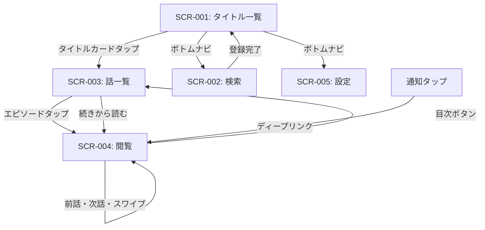
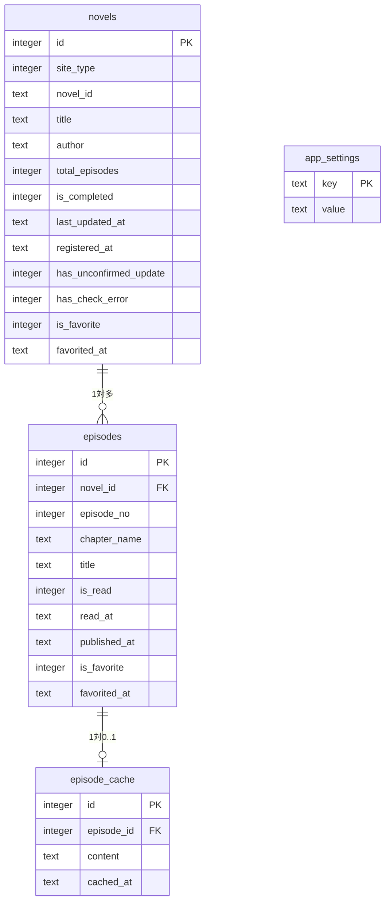

# 要件定義書

## メタ情報
| 項目 | 内容 |
|---|---|
| アプリ名 | ラノベリーダ |
| バージョン | 1.0（初版） |
| 作成日 | 2026-04-03 |
| ステータス | 確定 |
| 対象読者 | Claude Code（実装担当AI） |

> **このドキュメントの使い方**
> Claude Code に対して「このファイルに従ってアプリを実装してください」と渡してください。
> 追加確認なしに実装着手できる粒度で記述されています。

---

## 1. プロジェクト概要

### 1.1 背景・目的
既存のなろう・カクヨム閲覧アプリの以下の課題を解消するための個人用Androidアプリを開発する。
- 既存アプリのなろうキャッシュ取得機能が動作しなくなっている
- カクヨムの登録・閲覧に対応していない
- 複数アプリを使い分ける手間をなくし、1つのアプリで一元管理したい

### 1.2 利用者
| 種別 | 概要 | ITリテラシー |
|---|---|---|
| 個人利用者（作者本人） | なろう・カクヨムのラノベを日常的に読む個人 | 高 |

### 1.3 利用環境
| 項目 | 内容 |
|---|---|
| OS | Android 14以上（最低対応API Level 34） |
| ハードウェア | Androidスマートフォン（タブレット非対応） |
| ネットワーク | オンライン・オフライン両対応（キャッシュによるオフライン読書必須） |
| 配置形態 | スタンドアロン（単一端末インストール） |
| ストレージ | 内部ストレージのみ（外部SD非対応） |

---

## 2. 技術スタック

### 2.1 開発環境
| 項目 | 内容 |
|---|---|
| 言語 | C# 13 |
| フレームワーク | .NET 9 / .NET MAUI（Android対象） |
| IDE | Visual Studio 2022（MAUIワークロード導入済み） |
| 開発機OS | Windows 11 Pro 25H2 |
| アーキテクチャ | MVVM |
| DIコンテナ | Microsoft.Extensions.DependencyInjection（.NET標準） |
| MVVMヘルパー | CommunityToolkit.Mvvm |

### 2.2 主要パッケージ
| パッケージ名 | バージョン | 用途 |
|---|---|---|
| CommunityToolkit.Mvvm | 最新安定版 | MVVMヘルパー（ObservableObject・RelayCommand等） |
| sqlite-net-pcl | 最新安定版 | SQLiteアクセス（ORM） |
| SQLitePCLRaw.bundle_green | 最新安定版 | sqlite-net-pclの依存ライブラリ |
| AngleSharp | 最新安定版 | HTMLパース（スクレイピング） |
| Microsoft.Extensions.DependencyInjection | .NET9同梱 | DIコンテナ |
| System.Text.Json | .NET9同梱 | JSONパース（カクヨムAPI等） |

> HttpClientは.NET9標準のものを使用。NuGet追加不要。

### 2.3 ソリューション構成
```
LanobeReader/
├── LanobeReader/                   # MAUIアプリ本体
│   ├── Models/                     # データモデル・エンティティ
│   ├── ViewModels/                 # 各画面のViewModel
│   ├── Views/                      # 各画面のXAML/ContentPage
│   ├── Services/                   # ビジネスロジック・外部通信
│   │   ├── Narou/                  # なろうAPI・スクレイピング
│   │   ├── Kakuyomu/               # カクヨム公式API
│   │   └── Database/               # SQLiteアクセス
│   ├── Helpers/                    # ユーティリティクラス
│   ├── Converters/                 # IValueConverter実装
│   └── Platforms/
│       └── Android/                # Android固有実装（通知等）
└── LanobeReader.sln
```

### 2.4 命名規則
| 対象 | 規則 | 例 |
|---|---|---|
| クラス | PascalCase | NovelListViewModel |
| メソッド | PascalCase | FetchEpisodeAsync |
| プロパティ | PascalCase | IsLoading |
| プライベートフィールド | _camelCase | _dbService |
| 定数 | UPPER_SNAKE_CASE | DEFAULT_CACHE_MONTHS |
| インターフェース | I + PascalCase | INovelRepository |
| 非同期メソッド | 末尾Async | LoadNovelsAsync |

---

## 3. 機能要件

### 3.1 機能一覧
| 機能ID | 機能名 | 優先度 | 概要 |
|---|---|---|---|
| F-001 | タイトル検索・登録 | Must | キーワードでなろう・カクヨムを「タイトル+作者名」検索し管理リストに登録 |
| F-002 | タイトル一覧表示 | Must | 登録済み小説の一覧・未読話数・更新状況を表示 |
| F-003 | 更新チェック | Must | n時間毎の自動チェック＋アプリ起動時・手動チェック |
| F-004 | キャッシュ取得 | Must | 本文閲覧時に1話分をローカルに保存 |
| F-005 | 小説閲覧 | Must | 本文表示（キャッシュ優先・なければ都度取得） |
| F-006 | 既読管理 | Must | 読了点までの一括既読化（読了点を巻き戻すと N+1 以降は未読化） |
| F-006a | 自動既読化 ON/OFF | Should | 自動既読化を設定でオプトアウト可能にする |
| F-007 | 設定管理 | Must | キャッシュ期間・更新間隔・ページ件数・通信ポリシー・既読挙動・縦書き等の管理 |
| F-008 | 読書設定 | Must | フォントサイズ・背景色・行間のカスタマイズ |
| F-009 | 縦書き表示 | Should | 設定で縦書き ON/OFF を切替。WebView を使うハイブリッド実装 |
| F-010 | お気に入り（作品/話） | Should | 作品・話ごとに ★ トグル。一覧ソートと連動 |
| F-011 | ランキング/ジャンルブラウズ | Should | 期間別ランキング・大ジャンル別作品取得（なろう/カクヨム） |
| F-012 | 一括ダウンロード/先読み | Should | Wi-Fi 接続時のみバックグラウンドで未取得話をプリフェッチ |
| F-013 | 通信ポリシー | Must | サイト別 SemaphoreSlim 直列化＋設定可能なディレイ |
| F-014 | 一覧ソート | Should | 更新日時/タイトル/作者/未読数/お気に入り優先 |

### 3.2 機能詳細

---

#### F-001: タイトル検索・登録

**トリガー:** 検索画面（SCR-002）で検索キーワードを入力し検索ボタンをタップ。
モードは Keyword / Ranking / Genre browse の 3 種を SetModeXxxCommand で切替。

**入力:**
| パラメータ | 型 | バリデーション | 必須 |
|---|---|---|---|
| keyword | string | 1文字以上100文字以下。空文字は検索ボタンを非活性にする | ○ |
| searchNarou | bool | 検索対象サイト（デフォルト: true） | ○ |
| searchKakuyomu | bool | 検索対象サイト（デフォルト: true） | ○ |

> 旧版にあった `searchTarget` (Title / Author / Both) パラメータは廃止された (PR-7)。
> なろう側は常に「タイトル + 作者名」マッチで検索し、あらすじ・タグの全文検索は行わない。
> あらすじマッチで無関係作品が大量にヒットしていた問題への対処。

**処理フロー（正常系・Keyword モード）:**
1. 検索ボタンタップでIsLoadingをtrueにしインジケーター表示
2. searchNarouがtrueの場合、なろうAPIへGETリクエスト送信
   - エンドポイント: `https://api.syosetu.com/novelapi/api/?out=json&lim=20&word={keyword}&title=1&wname=1`
   - `title=1&wname=1` でタイトル + 作者名のいずれかマッチに絞り込む（公式仕様: `title`/`ex`/`keyword`/`wname` のフラグ未指定時のみ全項目検索、1 つでも指定があれば指定項目のみ）
3. searchKakuyomuがtrueの場合、`https://kakuyomu.jp/search?q={keyword}` の HTML をスクレイピング（タイトルアンカー `a[title][href*='/works/']` を最大 20 件取得）
4. 結果をSiteTypeを付与してマージし、SearchResultリストに格納
5. 各検索結果に対してnovelsテーブルを照合し、登録済みフラグ（isRegistered）を付与
6. 検索結果をSCR-002のリストに表示
7. IsLoadingをfalseに戻す

**処理フロー（Ranking モード・F-011）:**
1. 期間 (Daily/Weekly/Monthly/Quarterly) と大ジャンル (なろう側) / ジャンル slug (カクヨム側) を選択
2. なろう: `https://api.syosetu.com/rank/rankget/?out=json&rtype={yyyyMMdd-period}` で ncode 一覧取得 → `novelapi` で詳細を一括フェッチ → ランキング順に並び替え
3. カクヨム: `https://kakuyomu.jp/rankings/{genre}/{period}` の HTML をスクレイピング (`div.widget-work` で `p.widget-work-rank` 付きカードのみ列挙)。Quarterly はカクヨム非対応のため、選択時は赤バナーで通知して fetch を skip
4. 結果は Keyword モードと同じ SearchResults に流す

**処理フロー（Genre browse モード・F-011）:**
1. なろう: `FetchByGenreAsync(int? biggenre, "weeklypoint", 30)` で大ジャンル別を取得 (`biggenre=null` で全ジャンル、`biggenre={1,2,3,4,98,99}` で大ジャンル絞り込み)
2. カクヨム: `FetchRankingAsync(genreSlug, "weekly")` を流用

**処理フロー（異常系）:**
| エラー種別 | 検出条件 | 対処 | ユーザー通知 |
|---|---|---|---|
| 検索キーワード空 | keyword.Length == 0 | 検索ボタンを非活性化 | なし（ボタンが押せない） |
| ネットワークエラー | HttpRequestException / TaskCanceledException | エラーメッセージをインライン表示 | 「通信エラーが発生しました」をリスト上部に表示 |
| 検索結果0件 | results.Count == 0 | 空状態UIを表示 | 「見つかりませんでした」をリスト中央に表示 |
| タイムアウト | 5秒経過 | リクエストをキャンセル | 「タイムアウトしました」をインライン表示 |

**出力:**
| 出力先 | 内容 | 形式 |
|---|---|---|
| SCR-002リスト | 検索結果一覧 | SearchResultViewModelのリスト |
| novelsテーブル | 登録時にINSERT | novels行1件 |
| episodesテーブル | 登録時に話一覧をINSERT | episodes行N件 |

**登録処理（検索結果カードの登録ボタンタップ時）:**
1. isRegistered == true の場合は登録ボタンを非活性・「登録済」バッジ表示（登録不可）
2. isRegistered == false の場合はnovelsテーブルにINSERT
3. 話一覧APIを呼び出しepisodesテーブルに全話をINSERT
4. 登録完了後、該当カードのisRegisteredをtrueに更新しUIを即時反映

**非同期処理:** async/await必須（UIスレッドをブロックしない）
**排他制御:** 不要

---

#### F-002: タイトル一覧表示

**トリガー:** アプリ起動時 / ボトムナビの「一覧」タブタップ

**入力:** なし

**処理フロー（正常系）:**
1. novelsテーブルから全件をlast_updated_at DESCでSELECT
2. 各novelに対してepisodesテーブルからis_read=0の件数をカウントしunread_countを算出
3. NovelListViewModelのNovelsコレクションにバインド
4. タイトル未登録（Novels.Count == 0）の場合、SCR-002（検索画面）へ強制遷移

**処理フロー（異常系）:**
| エラー種別 | 検出条件 | 対処 | ユーザー通知 |
|---|---|---|---|
| DB読み込みエラー | SQLiteException | ログ出力 | 「データの読み込みに失敗しました」をSnackbar表示 |

**出力:**
| 出力先 | 内容 | 形式 |
|---|---|---|
| SCR-001リスト | タイトル一覧 | NovelCardViewModelのObservableCollection |

**長押しメニュー:**
- 「キャッシュを削除」→ 確認ダイアログ表示 → OKでepisode_cacheテーブルの該当novel_id行を全削除
- 「タイトルを削除」→ 確認ダイアログ表示 → OKでnovels・episodes・episode_cacheを全削除（CASCADE）

**非同期処理:** async/await
**排他制御:** 不要

---

#### F-003: 更新チェック

**トリガー:**
- アプリ起動時（OnStartup後）
- n時間毎のバックグラウンドタスク（Android WorkManager使用）
- SCR-001の手動更新ボタンタップ（has_check_errorがtrueの場合に表示）

**入力:**
| パラメータ | 型 | 説明 |
|---|---|---|
| update_interval_hours | int | app_settingsから取得（デフォルト6） |

**処理フロー（正常系）:**
1. novelsテーブルから全件取得
2. has_unconfirmed_update == true のタイトルはスキップ
3. 各タイトルに対してsite_typeに応じたAPIで最新話数・最終更新日時を取得
4. 現在のepisodesテーブルの最大episode_noと比較
5. 新着話がある場合:
   - 新着話のメタデータをepisodesテーブルにINSERT
   - novelsのlast_updated_atを更新
   - has_unconfirmed_update = 1 にUPDATE
   - プッシュ通知を発行: `{title}: {n}話更新`
   - 通知が未確認の間、以降の同タイトルの更新チェックはスキップ
6. 全タイトルチェック完了後、has_check_error = 0 にリセット

**処理フロー（異常系）:**
| エラー種別 | 検出条件 | 対処 | ユーザー通知 |
|---|---|---|---|
| ネットワークエラー | HttpRequestException | has_check_error = 1 にUPDATE。自動チェックを次回以降スキップ | プッシュ通知「更新チェックに失敗しました」。SCR-001に手動更新ボタンを表示 |
| タイムアウト | 30秒経過 | 同上 | 同上 |
| 二重実行 | チェック実行中フラグ確認 | 新規チェックをスキップ | なし |

**通知仕様:**
- タイトル: アプリ名（ラノベリーダ）
- 本文: `{novel.title}: {n}話更新`
- タップ時遷移: SCR-004（該当タイトルの最新未読話）
- 通知チャンネルID: `update_notification`
- 通知確認済み（タップ）→ has_unconfirmed_update = 0 にUPDATE

**非同期処理:** async/await（WorkManager内で実行）
**排他制御:** SemaphoreSlim(1,1)で二重実行防止

---

#### F-004: キャッシュ取得

**トリガー:** SCR-004（閲覧画面）表示時

**入力:**
| パラメータ | 型 | 説明 |
|---|---|---|
| episode_id | int | 取得対象のepisodeのDB id |
| site_type | SiteType enum | 1=なろう / 2=カクヨム |
| novel_id | string | 各サイトでの小説ID |
| episode_no | int | 話番号 |

**処理フロー（正常系）:**
1. episode_cacheテーブルで episode_id を検索
2. キャッシュが存在する場合: contentを返してSCR-004に表示（通信なし）
3. キャッシュが存在しない場合:
   - ネットワーク接続確認
   - site_typeに応じて本文取得
     - なろう: `https://ncode.syosetu.com/{ncode}/{episode_no}/` をAngleSharpでスクレイピング（`#novel_honbun` 要素のテキストを取得）
     - カクヨム: 公式APIで本文取得
   - 取得した本文をepisode_cacheテーブルにINSERT（cached_at = NOW）
   - contentを返してSCR-004に表示

**処理フロー（異常系）:**
| エラー種別 | 検出条件 | 対処 | ユーザー通知 |
|---|---|---|---|
| オフライン + キャッシュなし | 接続なし & cacheなし | 閲覧画面を表示しない | 「オフラインのため表示できません。キャッシュがありません」ダイアログ |
| 取得失敗（スクレイピング構造変化等） | contentが空 / パース失敗 | ログ出力 | 「本文の取得に失敗しました（エラー内容）」ダイアログ |
| タイムアウト | 5秒経過 | リクエストキャンセル | 「タイムアウトしました」ダイアログ |

**非同期処理:** async/await
**排他制御:** 不要

---

#### F-005: 小説閲覧

**トリガー:** SCR-002のタイトルカードタップ（最新未読話を開く） / SCR-003の話一覧からエピソードタップ / 通知タップ

**処理フロー（正常系）:**
1. F-004（キャッシュ取得）を呼び出し本文を取得
2. SCR-004にcontentをバインドして表示
3. F-006（既読マーク）を呼び出し（最後まで読んだ場合）
4. 前の話・次の話ボタン / 左右スワイプで隣話に遷移（episodesテーブルのepisode_noで前後を特定）
5. 前の話・次の話が存在しない場合は該当ボタンを非活性化
6. ヘッダ・フッタはスクロール中は非表示。タップで再表示
7. 目次ボタンタップでSCR-003に戻る（バックスタック）

**非同期処理:** async/await
**排他制御:** 不要

---

#### F-006: 既読管理（読了点までの一括既読化）

**トリガー:**
- 手動: SCR-004 フッタの「既読」ボタン (`MarkAsReadCommand`) — 常に発火
- 自動: 横書きのスクロール終端到達 (`OnScrolled`) または 縦書き WebView の `lanobe://read-end` ナビゲーション受信 (`MarkAsReadFromAutoCommand`) — `auto_mark_read_enabled=1` のときのみ発火

**処理フロー（正常系）:**
1. `EpisodeRepository.SetReadStateUpToAsync(novelId, episodeNo)` を 1 トランザクション 2 SQL で実行
   - `1..N`: `is_read=1`、`read_at = COALESCE(read_at, NOW)` で既存読了日時を保持
   - `N+1..max`: `is_read=0`、`read_at = NULL` に巻き戻し
2. 全話既読時は novels.has_unconfirmed_update を 0 にUPDATE
3. SCR-001 の unread_count を再計算して表示を更新

**読了点の巻き戻し挙動（仕様承認済み）:**
- 既読 N=10 状態でユーザが N=3 を再読 → 4..10 が未読化される。
- これは「読み直したらそれ以降を最後まで読み直したい」というユーザ要望に基づく仕様。再読時は「過去話を改めて読み進める起点」として扱われる。
- 単調増加既読化 (N+1 以降は触らない) は採用しない。

**異常系:**
| エラー種別 | 検出条件 | 対処 |
|---|---|---|
| 過去話を誤タップして巻き戻し発生 | ユーザの誤操作 | `read_at` は **復元不可**（アンドゥ機構なし、要件範囲外） |
| 自動既読化の意図しない発火（短編作品で画面遷移直後に終端到達等） | OnScrolled / read-end の即時発火 | 設定で `auto_mark_read_enabled=0` にすると自動経路を抑止可能。手動の「既読」ボタンは引き続き利用可 |

**非同期処理:** async/await
**排他制御:** 不要（SQL 側で WHERE 条件と is_read 再計算で完結）

---

#### F-006a: 自動既読化 ON/OFF 設定

**トリガー:** SCR-005（設定画面）の「スクロール終端で自動的に既読にする」トグル

**入力:**
| パラメータ | 型 | デフォルト |
|---|---|---|
| auto_mark_read_enabled | int | 0（OFF・誤操作で巻き戻しが起きにくい安全側を既定とする） |

**処理フロー:**
1. 設定変更で `app_settings.auto_mark_read_enabled` を即時 UPSERT
2. 次回 SCR-004 を開いたとき (`ReaderViewModel.LoadSettingsAsync`) または `OnAppearing` の `ReloadSettingsAsync` で `AutoMarkReadEnabled` プロパティに反映
3. `ReaderPage.xaml.cs` の `OnScrolled` / `OnWebViewNavigating` は `MarkAsReadFromAutoCommand` を経由し、ViewModel 側で `AutoMarkReadEnabled=false` なら no-op

**「自動 OFF + フッタ非表示」時の救済 UI:**
- `IsManualReadButtonOverlayVisible` 算出プロパティ (= `!AutoMarkReadEnabled && !IsFooterVisible`) で SCR-004 左下に既読ボタンを単独 Overlay 表示する。
- 現状 `ToggleHeaderFooter` コマンドは XAML/コードビハインドから binding されておらず到達不能だが、将来 binding 導入時の保険として先回り投入。

**非同期処理:** async/await
**排他制御:** 不要

---

#### F-007: 設定管理

**トリガー:** ボトムナビの「設定」タブタップ（SCR-005表示時）

**設定項目と保存先:**
| キー | 型 | デフォルト値 | 変更時の反映タイミング |
|---|---|---|---|
| cache_months | int | 3 | 次回キャッシュ削除時 |
| update_interval_hours | int | 6 | 次回 MainActivity.OnCreate 時に差分判定して再登録 |
| font_size_sp | int | 16 | SCR-004を次回開いた時 |
| background_theme | int | 0（白） | SCR-004を次回開いた時 |
| line_spacing | int | 1（普通） | SCR-004を次回開いた時 |
| episodes_per_page | int | 50 | SCR-003を次回開いた時 |
| vertical_writing | int | 0（横書き） | SCR-004 を次回開いた時。OnAppearing で `ReloadSettingsAsync` 呼び出しによりリーダー復帰時にも反映 |
| prefetch_enabled | int | 1（ON） | 即時（次回 `BackgroundJobQueue.EnqueueAsync` 呼出で参照） |
| request_delay_ms | int | 800 | 次回 HTTP リクエスト時。UI スライダーは 500-2000ms、`Math.Clamp` で UI 範囲に強制 |
| novel_sort_key | string | "updated_desc" | 即時（再ロードして並び替え反映） |
| auto_mark_read_enabled | int | 0（OFF） | SCR-004 を次回開いた時または OnAppearing で反映 |
| last_scheduled_hours | int | 6 | C-1 用の内部キー（毎起動でのリセット防止）。値は `update_interval_hours` の既定値と同期する |

> 設定値はすべて文字列で `app_settings` テーブルに UPSERT。`AppSettingsRepository` 起動時の
> `LoadAllAsync` で `_cache: ConcurrentDictionary<string,string>` に全件読み込み、以後はメモリヒット。
> `SetValueAsync` で DB 反映 + キャッシュ更新が同時に走る。

**キャッシュ手動クリア処理:**
1. 「キャッシュをすべてクリア」ボタンタップ
2. 確認ダイアログ表示「すべてのキャッシュを削除しますか？」
3. OKでepisode_cacheテーブルの全件DELETE
4. 「クリアしました」をSnackbar表示

---

#### F-008: 読書設定

**設定項目:**
| 設定名 | UIコントロール | 設定値 |
|---|---|---|
| フォントサイズ | Slider | 12〜24sp（整数値） |
| 背景色テーマ | SegmentedControl（3択） | 0=白背景/黒文字, 1=黒背景/白文字, 2=セピア背景/茶文字 |
| 行間 | SegmentedControl（3択） | 0=狭, 1=普通, 2=広 |

**各設定値の詳細:**

背景色テーマ:
| 値 | 背景色 | 文字色 |
|---|---|---|
| 0（白） | #FFFFFF | #212121 |
| 1（黒） | #121212 | #E0E0E0 |
| 2（セピア） | #F5E6C8 | #3E2C1C |

行間（LineHeight倍率）:
| 値 | 倍率 |
|---|---|
| 0（狭） | 1.4 |
| 1（普通） | 1.7 |
| 2（広） | 2.1 |

---

#### F-009: 縦書き表示

**トリガー:** SCR-005 の「縦書き表示」トグル

**処理フロー:**
1. 設定変更で `vertical_writing` を 0/1 で UPSERT
2. SCR-004 を次回開いた時に `IsVerticalWriting` を反映
3. 横書き = `Label` ベースの `ScrollView` 表示、縦書き = `ReaderWebView` (CSS `writing-mode: vertical-rl`) のハイブリッド構成
4. 縦書き時は `ReaderHtmlBuilder.Build(content, cssState)` で HTML を組み立て、CSS 変数（フォントサイズ・背景色・行間）は `ReaderCss` プロパティから WebView へ流す
5. WebView 側の `lanobe://read-end` / `lanobe://next-episode` / `lanobe://prev-episode` ナビゲーションをコードビハインドで捕捉して既読/前後遷移コマンドに連動

**実装上の注意:**
- `Label` と `ReaderWebView` は同じ `Grid.Row` に重ね、`IsVisible="{Binding IsHorizontal}"` / `"{Binding IsVerticalWriting}"` で切替
- `OnIsVerticalWritingChanged` で `RefreshHtml` を呼び、縦書き ON 時に既読 HTML を即時再生成

---

#### F-010: お気に入り（作品/話）

**トリガー:**
- 作品: SCR-001 の SwipeView 「★お気に入り」 / SCR-003 ツールバー「★作品」ボタン
- 話: SCR-003 の話カード右端 ★ ラベルタップ / SCR-004 ヘッダの ★ ボタン

**処理フロー（作品）:**
1. `NovelRepository.SetFavoriteAsync(novelId, bool)` で `is_favorite` と `favorited_at` (ON 時 NOW、OFF 時 NULL) を UPDATE
2. ViewModel 側のカード `IsFavorite` を反転して即時 UI 反映
3. `SortKey == "favorite_first"` のとき再ロードして並び替え

**処理フロー（話）:**
1. `EpisodeRepository.SetFavoriteAsync(episodeId, bool)` で同様に UPDATE
2. `ShowFavoritesOnly == true` のとき `RebuildFilterCache` + `RecalcPaging` でフィルタ更新

---

#### F-011: ランキング/ジャンルブラウズ

詳細は F-001 の Ranking / Genre browse モードに統合。なろう・カクヨムそれぞれの API/スクレイピング仕様は §7.1 / §7.2 を参照。

---

#### F-012: 一括ダウンロード/先読み

**トリガー:**
- 作品登録時: `SearchViewModel.RegisterAsync` 完了後に `_prefetch.EnqueueNovelAsync(novelId)` を fire-and-forget
- 起動時: `App.RunPrefetchAsync` で `PrefetchService.EnqueueAllUnreadAsync` (お気に入り優先順)
- 手動: SCR-003 ツールバー「一括 DL」ボタン (`DownloadAllCommand`) で `EnqueueNovelAsync(novelDbId, highPriority: true)`
- 更新チェック新着検出時: `UpdateCheckService` 内で各新着話を Enqueue

**処理フロー:**
1. `BackgroundJobQueue.EnqueueAsync` 入口で `prefetch_enabled=0` なら drop（完全抑止）
2. HashSet による重複抑止 + `Priority>0` で優先キューへ振り分け（同一 lock 内で完結）
3. Wi-Fi 接続時のみ Worker を起動。モバイル通信時/切断時は自動停止し、Wi-Fi 復帰時に未消化キューから resume
4. `NetworkPolicyService` 経由で 1 リクエストごとにディレイを挿入（`request_delay_ms` 設定）
5. 取得した本文を `episode_cache` に INSERT（`episode_id` UNIQUE）
6. 連続 5 失敗で同セッションを中断（次の Wi-Fi イベントで再開）

**異常系:**
| エラー種別 | 対処 |
|---|---|
| Wi-Fi 切断 | Worker break。HashSet を live キューに合わせて再構成し、再 Enqueue 可能な状態に戻す |
| 連続 5 失敗 | 同セッション中断、警告ログ出力 |
| 設定 OFF | Enqueue 自体を drop し、既存キューも Worker 入口で early return（二重ガード） |

---

#### F-013: 通信ポリシー（NetworkPolicyService）

**目的:** サイトへの過剰負荷を避け、リクエストを直列化してディレイを挿入する。

**設計:**
- サイト別 `SemaphoreSlim(1, 1)` で同サイトの並列リクエストを禁止
- リクエスト間隔は `request_delay_ms` 設定で調整 (`Math.Clamp(v, MIN_REQUEST_DELAY_MS=500, MAX_REQUEST_DELAY_MS=2000)`)
- `Connectivity.ConnectivityChanged` を監視し `WifiConnected` / `WifiDisconnected` イベントを `BackgroundJobQueue` へ通知
- `IsOnline` / `IsWifiConnected` プロパティを公開

**API:**
- `Task<string> GetStringAsync(SiteType site, string url, CancellationToken ct)` — gate + delay + GET を一括実行

---

#### F-014: 一覧ソート

**トリガー:** SCR-001 ツールバー「並び替え」 (`ChangeSortCommand`) でアクションシート選択

**ソートキー:**
| キー | 表示名 | SQL |
|---|---|---|
| updated_desc | 更新日時（新しい順） | `ORDER BY last_updated_at DESC` |
| updated_asc | 更新日時（古い順） | `ORDER BY last_updated_at ASC` |
| title_asc | タイトル昇順 | `ORDER BY title ASC` |
| title_desc | タイトル降順 | `ORDER BY title DESC` |
| author_asc | 作者昇順 | `ORDER BY author ASC` |
| registered_desc | 登録日時（新しい順） | `ORDER BY registered_at DESC` |
| unread_desc | 未読話数（多い順） | `ORDER BY unread_count DESC, last_updated_at DESC`（JOIN で算出） |
| favorite_first | お気に入り優先 | `ORDER BY is_favorite DESC, last_updated_at DESC` |

**保存:** 選択値は `app_settings.novel_sort_key` に即時 UPSERT。次回起動時に復元。

---

## 4. 画面設計

### 4.1 画面一覧
| 画面ID | 画面名 | 種別 | 概要 |
|---|---|---|---|
| SCR-001 | タイトル一覧画面 | ContentPage | 登録済み小説一覧（メイン画面） |
| SCR-002 | 検索画面 | ContentPage | キーワード検索・タイトル登録 |
| SCR-003 | 話一覧画面（目次） | ContentPage | 選択タイトルのエピソード一覧 |
| SCR-004 | 閲覧画面 | ContentPage | 本文表示 |
| SCR-005 | 設定画面 | ContentPage | キャッシュ期間・更新間隔・読書設定 |

### 4.2 ナビゲーション構造

**ボトムナビゲーションバー（常時表示）:**
| タブ | アイコン | 対応画面 |
|---|---|---|
| 一覧 | book-open | SCR-001 |
| 検索 | magnify | SCR-002 |
| 設定 | cog | SCR-005 |

**スタック遷移（ボトムナビに含まない）:**
- SCR-001 → SCR-003（タイトルカードタップ）
- SCR-003 → SCR-004（エピソードタップ / 続きから読むボタン）
- SCR-004 ⇔ SCR-004（前話・次話ボタン / スワイプ）
- SCR-004 → SCR-003（目次ボタンタップ、バックスタックに戻る）



### 4.3 画面詳細

---

#### SCR-001: タイトル一覧画面

**レイアウト概要:**
- 上部: ツールバー（アプリ名 + 手動更新ボタン※エラー時のみ表示）
- 中部: CollectionView（タイトルカードのリスト、更新日時DESC）
- 下部: BottomNavigationBar

**UIコントロール一覧:**
| コントロール | 種別 | バインディング先 | 備考 |
|---|---|---|---|
| 手動更新ボタン | ToolbarItem | RefreshCommand | HasCheckError == trueの場合のみIsVisible=true |
| タイトルカードリスト | CollectionView | Novels | 更新日時DESC固定 |
| タイトル名 | Label | Novel.Title | |
| サイト種別バッジ | Label | Novel.SiteTypeLabel | 「なろう」「カクヨム」 |
| 未読話数 | Label | Novel.UnreadCount | UnreadCount > 0の場合のみ表示 |
| 最終更新日時 | Label | Novel.LastUpdatedAt | |
| 連載/完結バッジ | Label | Novel.IsCompleted | |
| 空状態ビュー | View | Novels.Count == 0 | 「タイトルを登録してください」+ 検索画面へのリンク |
| 長押しメニュー | ContextMenu | | キャッシュ削除 / タイトル削除 |
| 確認ダイアログ（キャッシュ削除） | AlertDialog | | 「キャッシュを削除しますか？」OK/キャンセル |
| 確認ダイアログ（タイトル削除） | AlertDialog | | 「タイトルを削除しますか？この操作は元に戻せません。」OK/キャンセル |

**ViewModelプロパティ:**
| プロパティ名 | 型 | 初期値 | 概要 |
|---|---|---|---|
| Novels | ObservableCollection\<NovelCardViewModel\> | 空 | タイトル一覧 |
| IsLoading | bool | false | ローディングインジケーター制御 |
| HasCheckError | bool | false | 手動更新ボタン表示制御 |

**ViewModelコマンド:**
| コマンド名 | CanExecute条件 | Execute処理 |
|---|---|---|
| RefreshCommand | !IsLoading | F-003手動更新チェック実行 |
| NavigateToDetailCommand | 常時 | SCR-003へ遷移（引数: novel_id） |
| DeleteCacheCommand | 常時 | 確認ダイアログ → F-004キャッシュ削除 |
| DeleteNovelCommand | 常時 | 確認ダイアログ → novelsレコード削除（CASCADE） |

---

#### SCR-002: 検索画面

**レイアウト概要:**
- 上部: 検索バー（テキスト入力 + 検索ボタン）
- 上部サブ: 検索対象サイト切り替え（なろうON/OFF・カクヨムON/OFFのチェックボックス）
- 中部: CollectionView（検索結果カードのリスト）
- 下部: BottomNavigationBar

**UIコントロール一覧:**
| コントロール | 種別 | バインディング先 | 備考 |
|---|---|---|---|
| キーワード入力 | Entry | SearchKeyword | Placeholder: 「タイトル・作者名で検索」 |
| 検索ボタン | Button | SearchCommand | SearchKeyword.Length > 0かつ!IsLoadingで活性 |
| なろうチェック | CheckBox | SearchNarou | デフォルトtrue |
| カクヨムチェック | CheckBox | SearchKakuyomu | デフォルトtrue |
| 検索結果リスト | CollectionView | SearchResults | |
| タイトル名 | Label | Result.Title | |
| 作者名 | Label | Result.Author | |
| 総話数 | Label | Result.TotalEpisodes | |
| 連載状況 | Label | Result.IsCompleted | 「完結」「連載中」 |
| サイト種別 | Label | Result.SiteTypeLabel | |
| 登録済みバッジ | Label | Result.IsRegistered | IsRegistered==trueの場合表示 |
| 登録ボタン | Button | RegisterCommand | IsRegistered==trueの場合非活性 |
| ローディング | ActivityIndicator | IsLoading | |
| 空状態ビュー | View | SearchResults.Count == 0 && HasSearched | 「見つかりませんでした」 |
| エラービュー | View | HasError | エラーメッセージを表示 |

**ViewModelプロパティ:**
| プロパティ名 | 型 | 初期値 | 概要 |
|---|---|---|---|
| SearchKeyword | string | "" | 検索キーワード |
| SearchNarou | bool | true | なろう検索対象フラグ |
| SearchKakuyomu | bool | true | カクヨム検索対象フラグ |
| SearchResults | ObservableCollection\<SearchResultViewModel\> | 空 | 検索結果 |
| IsLoading | bool | false | ローディング制御 |
| HasSearched | bool | false | 検索実行済みフラグ（空状態表示判定用） |
| HasError | bool | false | エラー状態 |
| ErrorMessage | string | "" | エラーメッセージ内容 |

**ViewModelコマンド:**
| コマンド名 | CanExecute条件 | Execute処理 |
|---|---|---|
| SearchCommand | SearchKeyword.Length > 0 && !IsLoading | F-001検索実行 |
| RegisterCommand | !Result.IsRegistered | F-001登録処理 |

---

#### SCR-003: 話一覧画面（目次）

**レイアウト概要:**
- 上部: ツールバー（タイトル名 + 「続きから読む」ボタン）
- 中部: 章ごとグループ or ページングされたCollectionView
- 下部: ページングボタン（前へ / 次へ）＋ BottomNavigationBar非表示

**ページング仕様:**
- 章情報がある作品: 章ごとにグループ化して表示（ページングなし）
- 章情報がない作品: episodes_per_page件ずつページング表示（デフォルト50件）
- ページ切り替えボタン: 「◀ 前へ」「次へ ▶」（最初のページは「前へ」非活性、最後のページは「次へ」非活性）

**UIコントロール一覧:**
| コントロール | 種別 | バインディング先 | 備考 |
|---|---|---|---|
| タイトル名 | ToolbarTitle | Novel.Title | |
| 続きから読むボタン | ToolbarItem | ReadContinueCommand | LastReadEpisodeが存在する場合のみ表示 |
| エピソードリスト | CollectionView | Episodes | |
| 話番号 | Label | Episode.EpisodeNo | |
| 話タイトル | Label | Episode.Title | |
| 既読インジケーター | View | Episode.IsRead | 既読: 文字色グレー。未読: 文字色通常 |
| 前へボタン | Button | PrevPageCommand | CurrentPage == 1の場合非活性 |
| 次へボタン | Button | NextPageCommand | CurrentPage == MaxPageの場合非活性 |

**ViewModelプロパティ:**
| プロパティ名 | 型 | 初期値 | 概要 |
|---|---|---|---|
| Novel | NovelViewModel | null | 対象タイトル |
| Episodes | ObservableCollection\<EpisodeViewModel\> | 空 | 現在ページのエピソード |
| CurrentPage | int | 1 | 現在ページ番号 |
| MaxPage | int | 0 | 最大ページ数 |
| HasChapters | bool | false | 章情報ありフラグ |

**ViewModelコマンド:**
| コマンド名 | CanExecute条件 | Execute処理 |
|---|---|---|
| ReadContinueCommand | LastReadEpisode != null | SCR-004へ遷移（最後に読んだ話） |
| NavigateToEpisodeCommand | 常時 | F-004 → SCR-004へ遷移 |
| PrevPageCommand | CurrentPage > 1 | CurrentPage-- + エピソード再取得 |
| NextPageCommand | CurrentPage < MaxPage | CurrentPage++ + エピソード再取得 |

---

#### SCR-004: 閲覧画面

**レイアウト概要:**
- 最上部: ヘッダ（話タイトル + 目次ボタン + 前へボタン）※スクロール中は非表示
- 中部: ScrollView（本文テキスト）
- 最下部: フッタ（目次ボタン + 前へボタン + 次へボタン）※スクロール中は非表示
- タップで再表示

**UIコントロール一覧:**
| コントロール | 種別 | バインディング先 | 備考 |
|---|---|---|---|
| ヘッダ | Grid | IsHeaderVisible | タップで再表示 |
| 話タイトル（ヘッダ） | Label | Episode.Title | |
| 目次ボタン（ヘッダ） | Button | NavigateToTocCommand | SCR-003に戻る |
| 前へボタン（ヘッダ） | Button | PrevEpisodeCommand | 前話なしの場合非活性 |
| 本文 | Label | EpisodeContent | フォントサイズ・行間・文字色をバインド |
| 本文ScrollView | ScrollView | | スクロール末尾検知で既読マーク |
| フッタ | Grid | IsFooterVisible | タップで再表示 |
| 目次ボタン（フッタ） | Button | NavigateToTocCommand | |
| 前へボタン（フッタ） | Button | PrevEpisodeCommand | 前話なしの場合非活性 |
| 次へボタン（フッタ） | Button | NextEpisodeCommand | 次話なしの場合非活性 |
| ローディング | ActivityIndicator | IsLoading | 本文取得中 |

**ViewModelプロパティ:**
| プロパティ名 | 型 | 初期値 | 概要 |
|---|---|---|---|
| Episode | EpisodeViewModel | null | 対象エピソード |
| EpisodeContent | string | "" | 本文テキスト |
| IsLoading | bool | true | ローディング制御 |
| IsHeaderVisible | bool | true | ヘッダ表示制御 |
| IsFooterVisible | bool | true | フッタ表示制御 |
| FontSize | double | 16 | app_settingsから取得 |
| LineHeight | double | 1.7 | app_settingsから取得 |
| BackgroundColor | Color | #FFFFFF | app_settingsから取得 |
| TextColor | Color | #212121 | app_settingsから取得 |
| HasPrevEpisode | bool | false | 前話存在フラグ |
| HasNextEpisode | bool | false | 次話存在フラグ |

**ViewModelコマンド:**
| コマンド名 | CanExecute条件 | Execute処理 |
|---|---|---|
| PrevEpisodeCommand | HasPrevEpisode | 前話をSCR-004で開く |
| NextEpisodeCommand | HasNextEpisode | 次話をSCR-004で開く |
| NavigateToTocCommand | 常時 | SCR-003に戻る |
| ToggleHeaderFooterCommand | 常時 | IsHeaderVisible/IsFooterVisibleをトグル |
| MarkAsReadCommand | !Episode.IsRead | F-006既読マーク（ScrollView末尾到達時に自動呼び出し） |

**スワイプ操作:**
- 右スワイプ: PrevEpisodeCommand実行
- 左スワイプ: NextEpisodeCommand実行

---

#### SCR-005: 設定画面

**レイアウト概要:**
- ScrollView内にグループ分けされたセクション
- 下部: BottomNavigationBar

**セクション構成:**

**📦 キャッシュ設定:**
| コントロール | 種別 | バインディング先 | 備考 |
|---|---|---|---|
| 保存期間スライダー | Slider | CacheMonths | 1〜24（整数値）、現在値ラベル併記 |
| キャッシュをクリアボタン | Button | ClearCacheCommand | 確認ダイアログあり |

**🔄 更新設定:**
| コントロール | 種別 | バインディング先 | 備考 |
|---|---|---|---|
| チェック間隔スライダー | Slider | UpdateIntervalHours | 1〜24（整数値）、現在値ラベル併記 |

**📖 読書設定:**
| コントロール | 種別 | バインディング先 | 備考 |
|---|---|---|---|
| フォントサイズスライダー | Slider | FontSizeSp | 12〜24（整数値）、プレビューテキスト表示 |
| 背景色選択 | SegmentedControl | BackgroundTheme | 白 / 黒 / セピア |
| 行間選択 | SegmentedControl | LineSpacing | 狭 / 普通 / 広 |

**📄 目次ページ設定:**
| コントロール | 種別 | バインディング先 | 備考 |
|---|---|---|---|
| 1ページ件数スライダー | Slider | EpisodesPerPage | 10〜100（10刻み）、現在値ラベル併記 |

**設定値はスライダー操作・選択変更の都度app_settingsテーブルにUPSERT。**

---

## 5. データ設計

### 5.1 テーブル定義

#### novelsテーブル
| カラム名 | 型 | NULL | PK | デフォルト | 説明 |
|---|---|---|---|---|---|
| id | INTEGER | NG | ○ | AUTOINCREMENT | 内部ID |
| site_type | INTEGER | NG | | | サイト種別（1=なろう / 2=カクヨム） |
| novel_id | TEXT | NG | | | 各サイトでの小説ID |
| title | TEXT | NG | | | タイトル名 |
| author | TEXT | NG | | | 作者名 |
| total_episodes | INTEGER | NG | | 0 | 総話数 |
| is_completed | INTEGER | NG | | 0 | 完結フラグ（0=連載中 / 1=完結） |
| last_updated_at | TEXT | OK | | NULL | 最終更新日時（ISO8601） |
| registered_at | TEXT | NG | | | 登録日時（ISO8601） |
| has_unconfirmed_update | INTEGER | NG | | 0 | 更新通知未確認フラグ |
| has_check_error | INTEGER | NG | | 0 | 更新チェックエラーフラグ |
| is_favorite | INTEGER | NG | | 0 | お気に入りフラグ（F-010） |
| favorited_at | TEXT | OK | | NULL | お気に入り登録日時（ISO8601） |

ユニーク制約: `idx_novels_site_novel = UNIQUE (site_type, novel_id)`（v1 から整備）

#### episodesテーブル
| カラム名 | 型 | NULL | PK | デフォルト | 説明 |
|---|---|---|---|---|---|
| id | INTEGER | NG | ○ | AUTOINCREMENT | 内部ID |
| novel_id | INTEGER | NG | | | novelsテーブルのid（外部キー） |
| episode_no | INTEGER | NG | | | 話番号（サイト上の番号） |
| chapter_name | TEXT | OK | | NULL | 章タイトル（章なし作品はNULL） |
| title | TEXT | NG | | | 話タイトル |
| is_read | INTEGER | NG | | 0 | 既読フラグ（0=未読 / 1=既読） |
| read_at | TEXT | OK | | NULL | 既読日時（ISO8601）。F-006 の SetReadStateUpToAsync で N+1 以降は NULL に巻き戻される |
| published_at | TEXT | OK | | NULL | 公開日時（ISO8601） |
| is_favorite | INTEGER | NG | | 0 | お気に入りフラグ（F-010） |
| favorited_at | TEXT | OK | | NULL | お気に入り登録日時（ISO8601） |

インデックス:
- `idx_episodes_novel_episode`: **UNIQUE** `(novel_id, episode_no)` - 前後話特定 + 重複防止（schema v2 で UNIQUE 化、重複レコードは除去後に再構築）

#### episode_cacheテーブル
| カラム名 | 型 | NULL | PK | デフォルト | 説明 |
|---|---|---|---|---|---|
| id | INTEGER | NG | ○ | AUTOINCREMENT | 内部ID |
| episode_id | INTEGER | NG | | | episodesテーブルのid（外部キー） |
| content | TEXT | NG | | | 本文テキスト |
| cached_at | TEXT | NG | | | キャッシュ取得日時（ISO8601） |

ユニーク制約: `(episode_id)`
インデックス:
- `idx_cache_episode_id`: (episode_id) - キャッシュ検索高速化
- `idx_cache_cached_at`: (cached_at) - 期限切れ削除用

#### app_settingsテーブル
| カラム名 | 型 | NULL | PK | 説明 |
|---|---|---|---|---|
| key | TEXT | NG | ○ | 設定キー |
| value | TEXT | NG | | 設定値（文字列で統一） |

初期レコード（アプリ初回起動時 INSERT、`SeedSettingsAsync` が `INSERT OR IGNORE` 相当の missing-only 動作で投入）:
| key | value | 由来定数 |
|---|---|---|
| cache_months | 3 | `SettingsKeys.DEFAULT_CACHE_MONTHS` |
| update_interval_hours | 6 | `SettingsKeys.DEFAULT_UPDATE_INTERVAL_HOURS` |
| font_size_sp | 16 | `SettingsKeys.DEFAULT_FONT_SIZE_SP` |
| background_theme | 0 | `SettingsKeys.DEFAULT_BACKGROUND_THEME` |
| line_spacing | 1 | `SettingsKeys.DEFAULT_LINE_SPACING` |
| episodes_per_page | 50 | `SettingsKeys.DEFAULT_EPISODES_PER_PAGE` |
| prefetch_enabled | 1 | `SettingsKeys.DEFAULT_PREFETCH_ENABLED` |
| request_delay_ms | 800 | `SettingsKeys.DEFAULT_REQUEST_DELAY_MS` |
| vertical_writing | 0 | `SettingsKeys.DEFAULT_VERTICAL_WRITING` |
| novel_sort_key | "updated_desc" | `SettingsKeys.DEFAULT_NOVEL_SORT_KEY` |
| last_scheduled_hours | 6 | `SettingsKeys.DEFAULT_UPDATE_INTERVAL_HOURS` と同期 |
| auto_mark_read_enabled | 0 | `SettingsKeys.DEFAULT_AUTO_MARK_READ_ENABLED` |

> 既定値はすべて `SettingsKeys.DEFAULT_*` 定数経由で参照する（`SeedSettingsAsync` のリテラル直書きは PR-4 / L-1 で排除済み）。

#### スキーマバージョン管理

`app_settings.schema_version`（int）でマイグレーションを管理する。`DatabaseService.CURRENT_SCHEMA_VERSION` と比較し、低ければ `MigrateAsync(fromVersion)` を順次適用。

| version | 適用内容 |
|---|---|
| v1 | 初版テーブル群 + `idx_novels_site_novel` UNIQUE |
| v2 | `idx_episodes_novel_episode` を UNIQUE 化（重複レコード除去後にインデックス再作成）、`is_favorite` / `favorited_at` カラム追加 |

マイグレーション失敗時は `schema_version` を上げず、次回起動で再試行する。

### 5.2 ER図


### 5.3 データ保持ポリシー
| データ種別 | 保存先 | 保存期間 | 削除ポリシー |
|---|---|---|---|
| 本文キャッシュ | episode_cacheテーブル | app_settings.cache_monthsヶ月 | 起動時に`cached_at < NOW - cache_months`の行を自動削除 |
| 本文キャッシュ（手動） | episode_cacheテーブル | - | 設定画面ボタン or 長押しメニューから即時全削除 or 該当タイトルのみ削除 |
| タイトル削除時 | novels/episodes/episode_cache | - | novels削除→CASCADE削除（episodes→episode_cache） |

### 5.4 SiteType定義（コード管理）
```csharp
public enum SiteType
{
    Narou = 1,
    Kakuyomu = 2,
    // 将来拡張: Hameln = 3, など
}
```

---

## 6. 非機能要件

### 6.1 パフォーマンス
| 項目 | 要件値 |
|---|---|
| 通常画面応答時間 | 1秒以内 |
| 検索結果表示 | 3秒以内（タイムアウト5秒） |
| 本文表示（キャッシュあり） | 0.5秒以内 |
| 本文表示（キャッシュなし・通信） | 5秒以内（タイムアウト5秒） |
| 更新チェック（全タイトル） | タイムアウト30秒 |
| HttpClientタイムアウト | 5秒（更新チェックは30秒） |

### 6.2 起動・終了処理

**起動時（MauiProgram.cs / App.xaml.cs）:**
1. DIコンテナ構築（サービス・ViewModelの登録）
2. SQLiteデータベース初期化（マイグレーション・テーブル存在確認）
3. app_settingsの初期レコード投入（存在しない場合のみ）
4. 期限切れキャッシュの自動削除（cached_at < NOW - cache_months）
5. WorkManagerによる定期更新チェックのスケジュール設定
6. novelsテーブルのレコード数確認 → 0件ならSCR-002（検索画面）へ強制遷移
7. 1件以上ならSCR-001（一覧画面）を表示し更新チェックを非同期実行

**終了時:**
- 特別な後処理なし（HttpClientは都度使用・SQLite接続はusing管理）

### 6.3 例外・エラーハンドリング
| 例外種別 | 捕捉箇所 | ログ | ユーザー通知 |
|---|---|---|---|
| 未捕捉例外 | App.xaml.cs UnhandledException | Debug.WriteLine (ERROR) | 「予期しないエラーが発生しました」AlertDialog → アプリ継続 |
| HTTP通信エラー | 各Serviceクラス | Debug.WriteLine (WARN) | 画面インライン or Snackbar表示 |
| SQLiteエラー | 各Repositoryクラス | Debug.WriteLine (ERROR) | Snackbar「データの操作に失敗しました」 |
| スクレイピング失敗 | NarouScraperService | Debug.WriteLine (WARN) | AlertDialog「本文の取得に失敗しました」 |
| タイムアウト | TaskCanceledException捕捉 | Debug.WriteLine (WARN) | 「タイムアウトしました」表示 |

### 6.4 ログ要件
| 項目 | 内容 |
|---|---|
| 出力方法 | Debug.WriteLine（Android Logcat）のみ |
| 対象 | デバッグビルドのみ。リリースビルドでは最小限（クラッシュのみ） |
| フォーマット | `[LanobeReader][{ClassName}] {message}` |
| ファイル出力 | なし |

### 6.5 配布・インストール
| 項目 | 内容 |
|---|---|
| 配布方式 | 自己用途のためAPKを直接インストール（サイドロード） |
| ビルド設定 | Releaseビルド / Android対象 |
| 必要ランタイム | .NET 9 Android Runtime（APKに同梱） |
| 最低対応APIレベル | 34（Android 14） |

### 6.6 通知設定
| 項目 | 内容 |
|---|---|
| 通知チャンネルID | `update_notification` |
| チャンネル名 | 「更新通知」 |
| 重要度 | NotificationImportance.Default |
| エラー通知チャンネルID | `error_notification` |
| エラーチャンネル名 | 「エラー通知」 |
| バックグラウンド実行 | Android WorkManager（PeriodicWorkRequest） |

---

## 7. 外部連携仕様

### 7.1 小説家になろう（なろう）

**メタデータ取得API:**
| 項目 | 内容 |
|---|---|
| エンドポイント | `https://api.syosetu.com/novelapi/api/` |
| 通信方式 | HTTPS GET |
| レスポンス形式 | JSON（`out=json`パラメータ指定） |
| ライブラリ | HttpClient + System.Text.Json |

主要クエリパラメータ:
| パラメータ | 説明 |
|---|---|
| out | json固定 |
| lim | 取得件数（検索時: 20） |
| word | タイトル+作者検索キーワード |
| ncode | ncode指定（更新チェック時） |
| of | 取得フィールド絞り込み（t,w,n,ga,gl,noveltype,end） |

取得フィールドマッピング:
| APIフィールド | テーブルカラム | 説明 |
|---|---|---|
| ncode | novel_id | なろう小説コード |
| title | title | タイトル |
| writer | author | 作者名 |
| general_all_no | total_episodes | 総話数 |
| novel_type | - | 1=連載/2=短編 |
| end | is_completed | 0=連載中/1=完結 |
| general_lastup | last_updated_at | 最終更新日時 |

**本文スクレイピング:**
| 項目 | 内容 |
|---|---|
| URL形式 | `https://ncode.syosetu.com/{ncode}/{episode_no}/` |
| 本文要素 | `#novel_honbun`（CSSセレクタ） |
| ライブラリ | AngleSharp |
| User-Agent | `Mozilla/5.0 (compatible; LanobeReader/1.0)` |

エラー時の挙動:
- タイムアウト: 5秒でキャンセル → AlertDialog表示
- HTTPエラー（4xx/5xx）: AlertDialog「本文の取得に失敗しました（HTTPエラー: {code}）」
- パース失敗（要素なし）: AlertDialog「本文の取得に失敗しました（サイト構造が変わった可能性があります）」

---

### 7.2 カクヨム

**公式API:**
| 項目 | 内容 |
|---|---|
| ベースURL | `https://kakuyomu.jp/api/` |
| 通信方式 | HTTPS GET/POST |
| レスポンス形式 | JSON |
| 認証 | 不要（公開API） |
| ライブラリ | HttpClient + System.Text.Json |

主要エンドポイント:
| 用途 | エンドポイント |
|---|---|
| 検索 | `GET /search?q={keyword}&type=work` |
| 作品情報 | `GET /works/{work_id}` |
| 話一覧 | `GET /works/{work_id}/episodes` |
| 本文取得 | `GET /works/{work_id}/episodes/{episode_id}` |

> ※カクヨムの正確なAPIエンドポイント・レスポンス形式は実装時に公式ドキュメントを参照すること。上記は参考値。

エラー時の挙動:
- タイムアウト: 5秒でキャンセル → AlertDialog表示
- HTTPエラー: AlertDialog「カクヨムとの通信に失敗しました（エラー: {message}）」

---

## 8. 実装上の注意事項・設計方針

### 8.1 依存性注入（DI）
- すべてのService・Repository・ViewModelはDIコンテナで管理する
- ViewModelのコンストラクタでは非同期処理を行わず、`InitializeAsync()`メソッドを別途用意し、画面表示後に呼び出す
- HttpClientはシングルトンとして登録する（`IHttpClientFactory`推奨）

### 8.2 非同期処理
- UIをブロックする処理はすべて`async/await`で実装する
- `ConfigureAwait(false)`はServiceレイヤーで使用し、ViewModelでは使用しない
- CancellationTokenを受け取るメソッドシグネチャにする（特にHTTP通信・更新チェック）

### 8.3 データベースアクセス
- SQLiteへのアクセスはすべてRepositoryクラスに集約する
- SQLite接続はシングルトンで管理する（`SQLiteAsyncConnection`）
- タイトル削除時は必ず novels → episodes → episode_cache の順でDELETEし、孤立レコードを発生させない

### 8.4 SiteType拡張
- SiteTypeはenumで管理し、新サイト追加時はenum値とサービスクラスの追加のみで対応できる設計にする
- ファクトリーパターン（`INovelServiceFactory`）でSiteTypeに応じたサービスを取得する

### 8.5 更新チェック（WorkManager）
- Android WorkManagerの`PeriodicWorkRequest`で定期実行を管理する
- 二重実行防止のためSemaphoreSlim(1,1)を使用し、finallyブロックで必ずRelease()する
- `has_unconfirmed_update == true`のタイトルは更新チェックをスキップする処理を最初に実行する

### 8.6 通知ディープリンク
- 更新通知タップ時はSCR-004へ遷移するためIntentにnovel_idとepisode_idを埋め込む
- 通知タップ後に`has_unconfirmed_update`を0にUPDATEする

### 8.7 閲覧画面の既読マーク
- ScrollViewのScrolled イベントでスクロール位置を監視し、`ScrollY + Height >= ContentSize.Height - 10` となった時点で既読マークを実行する

### 8.8 キャッシュ削除
- 起動時の期限切れキャッシュ削除はバックグラウンドスレッドで実行し、UIの表示をブロックしない

---

## 9. 未決事項

このセクションは存在しません。すべての事項が確定済みです。
