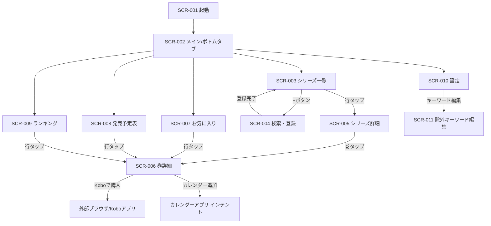
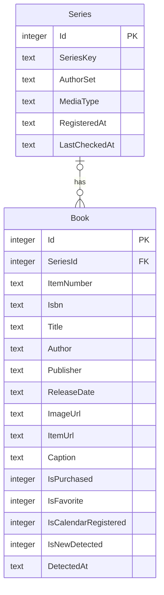

# 要件定義書

## メタ情報
| 項目 | 内容 |
|---|---|
| アプリ名 | 新刊チェッカー（仮称） |
| バージョン | 1.0（初版） |
| 作成日 | 2026-05-28 |
| ステータス | 確定 |
| 対象読者 | Claude Code（実装担当AI） |

> **このドキュメントの使い方**
> Claude Code に対して「このファイルに従ってアプリを実装してください」と渡してください。追加確認なしに実装着手できる粒度で記述されています。
>
> **CLAUDE.md との役割分担（重要）**
> 既存ライブラリの具体名・バージョン・利用方法、ロギング基盤・UI通知基盤の具体仕様、秘密情報の具体値などは **`CLAUDE.md` を正とする**。本書はそれらを抽象的な役割（例: HTTP通信基盤、ロギング基盤）として参照する。本書と `CLAUDE.md` で情報が食い違う場合、ライブラリ・実装詳細は `CLAUDE.md` を優先する。

---

## 1. プロジェクト概要

### 1.1 背景・目的
ライトノベル・コミックの新刊を手作業でチェックするのが面倒であるという課題を解決するための、個人用 Android アプリ。追跡したい作品（シリーズ）を登録しておくと、アプリが定期的に新刊（予約・近刊含む）の有無を自動チェックし、新刊を検知したらプッシュ（ローカル）通知で知らせる。あわせて、Kobo 全体の新刊発掘（発売予定表・ランキング）や、お気に入り・購入済み管理、Google カレンダーへの発売日登録といった読書管理機能を提供する。

### 1.2 利用者
| 種別 | 概要 | ITリテラシー |
|---|---|---|
| 開発者本人 | 個人利用。電子書籍（楽天Kobo）で購入することがほとんど | 高 |

### 1.3 利用環境
| 項目 | 内容 |
|---|---|
| OS | Android 13 / API 33 以上 |
| ハードウェア | Android スマートフォン |
| ネットワーク | オンライン（新刊チェック・検索時）。取得済みデータ（登録シリーズ・お気に入り）はオフラインでも閲覧可 |
| 配置形態 | スタンドアロン（端末内完結、サーバー不要） |
| 既存システムとの関係 | 新規独立アプリ |

### 1.4 配布形態
当面は開発者の端末に APK/AAB を直接インストールして使用する。Google Play 公開は将来の検討事項とし、本要件には含めない（公開を決めた段階でプライバシーポリシー・データ安全性申告・署名鍵管理等を別途詰める）。

---

## 2. 技術スタック

### 2.1 開発環境
| 項目 | 内容 |
|---|---|
| 言語 | C# 12 |
| フレームワーク | .NET 9 / .NET MAUI |
| ターゲットフレームワーク | `net9.0-android`（全プロジェクト） |
| IDE | Visual Studio 2022（MAUI ワークロード） |
| アーキテクチャ | MVVM（CommunityToolkit.Mvvm）＋ Microsoft.Extensions.DependencyInjection（MAUI 標準 DI） |

### 2.2 主要パッケージ
| パッケージ名 | 用途 |
|---|---|
| CommunityToolkit.Mvvm | MVVM 支援（ObservableObject, RelayCommand 等） |
| Microsoft.Extensions.DependencyInjection | DI コンテナ（MAUI 標準。`MauiProgram.cs` の `builder.Services`） |
| System.Text.Json | JSON シリアライズ／デシリアライズ（標準ライブラリ） |
| sqlite-net-pcl | SQLite ORM（ローカルキャッシュ） |
| Xamarin.AndroidX.Work.Runtime | Android WorkManager（バックグラウンド定期チェック） |
| Plugin.LocalNotification | ローカル通知 |

> バージョンは実装時に最新の安定版を使用し、`CLAUDE.md` に確定値を記載する。既存の自作ライブラリ（ロギング基盤・UI通知基盤等）がある場合はそれを優先利用する（具体は `CLAUDE.md` 参照）。

### 2.3 ソリューション構成
レイヤー分割（App / Core / Data の3プロジェクト）。新規作成する汎用部品（API通信基盤・SQLiteアクセス基盤・ローカル通知基盤・ログ出力基盤）は、特定アプリに密結合させず、別システムでも再利用可能な設計とする。汎用部品はインターフェース越しに参照し、外部依存（秘密情報プロバイダ等）は差し替え可能にする。

```
NewReleaseChecker/
├── NewReleaseChecker.App/      # MAUI UI（Views, ViewModels, App.xaml, MauiProgram.cs）
│   ├── Views/
│   ├── ViewModels/
│   └── Platforms/Android/      # WorkManager 実装、通知のAndroid固有処理
├── NewReleaseChecker.Core/     # ドメインモデル・サービス・インターフェース（再利用可能）
│   ├── Models/
│   ├── Services/
│   └── Abstractions/           # ISecretsProvider, IRakutenApiClient 等のインターフェース
└── NewReleaseChecker.Data/     # DB アクセス・API クライアント実装（再利用可能基盤）
    ├── Database/
    └── Api/
```

> 注: 全プロジェクトを `net9.0-android` とする（個人用の割り切り）。汎用部品は UI/プラットフォームに依存しない設計にしてあるため、将来プレーン `net9.0` 化する場合も移行は容易。

### 2.4 命名規則
標準的な .NET 規約に従う。詳細・例外は `CLAUDE.md` を正とする。

| 対象 | 規則 | 例 |
|---|---|---|
| クラス | PascalCase | SeriesDetailViewModel |
| メソッド | PascalCase | CheckNewReleasesAsync |
| プロパティ | PascalCase | IsFavorite |
| プライベートフィールド | _camelCase | _apiClient |
| 定数 | PascalCase または UPPER_SNAKE | MaxSeriesPerWork |

---

## 3. 機能要件

### 3.1 機能一覧
| 機能ID | 機能名 | 優先度 | 概要 |
|---|---|---|---|
| F-001 | シリーズ検索・登録 | Must | 楽天Kobo APIでタイトル検索し、追跡シリーズを登録 |
| F-002 | 登録シリーズ一覧表示 | Must | 登録済みシリーズと最新巻・未購入件数を一覧表示 |
| F-003 | 新刊チェック（手動） | Must | 更新操作でバックグラウンドの新刊チェックを即時キック |
| F-004 | 新刊チェック（自動） | Must | WorkManager が周期実行で新刊を確認 |
| F-005 | 新刊通知 | Must | 予約検知時にローカル通知（複数は集約） |
| F-006 | シリーズ詳細表示 | Must | シリーズ情報＋巻一覧（情報のみ表示） |
| F-007 | シリーズ削除 | Must | 紐づく巻データも含めて一括削除 |
| F-008 | 設定 | Must | チェック周期・通知ON/OFF・除外キーワード管理 |
| F-009 | 発売予定表 | Should | Kobo全体のラノベ・コミック近刊・予約を一覧表示 |
| F-010 | お気に入り一覧 | Must | お気に入り登録した巻の一覧 |
| F-011 | ランキング | Should | Koboの売れ筋ランキング表示 |
| F-012 | 購入済フラグ管理 | Must | 巻ごとの購入済み管理 |
| F-013 | Googleカレンダー連携 | Should | インテント経由で発売日をカレンダー登録 |
| F-014 | 巻詳細表示 | Must | 1巻の詳細情報＋アクション群 |

### 3.2 中核ロジック：シリーズ同定と新刊検知

本アプリの心臓部。F-001 / F-003 / F-004 が共通して使用する。

#### 3.2.1 シリーズ同定ロジック
- **シリーズ名（追跡キー）**: 登録時にタイトルから自動抽出（巻数・副題は同定には使わない）。ユーザーが登録確認ダイアログで手修正可能。
- **著者集合（AuthorSet）**: 著者文字列を区切り文字（`/`、`,`、空白等）で分割し、集合として保持。登録確認ダイアログでユーザーが不要な著者を除外可能。
- **検索クエリ（新刊チェック時）**: F-003/F-004 の定期・手動チェック、および F-001 登録時の既刊収集では、**シリーズキー（タイトル語）をキーワードとして楽天Kobo APIを検索**して候補巻を取得する。著者名は検索パラメータには使わず、取得候補に対して下記「同定方式」（著者集合の一致判定）を適用して同一シリーズの巻を選別する。
  - 役割分担: **タイトルキーワード＝シリーズの範囲を限定**、**著者集合の一致＝コミカライズ等の弁別**。著者名で検索すると同一著者の別シリーズが混入し1シリーズへ誤統合されるため、検索キーはタイトルとする。
  - シリーズキーは登録時にタイトルから巻数・副題を除いて抽出した語を用いる。副題リネーム等での取りこぼしは追跡キー編集（F-006）で調整する。
  - **複数語のAND検索**: 追跡キーに半角スペースを含めると、楽天Kobo検索APIの keyword 仕様（`orFlag` 既定=0）により**すべての語を含む候補のみ**へ絞り込む（AND検索）。タイトル中央に巻数があり1語では満足にシリーズを限定できないケースで、非連続な複数語により範囲を絞るために用いる。全角スペースは半角へ正規化し、楽天APIが弾く1文字トークンは複数語時に除外する。注意: AND は再現率（recall）を下げるため、**全巻に共通して現れる語**を選ぶこと（巻ごとに変わる副題語を含めると後続巻を取りこぼす）。
- **同定方式（著者集合の一致判定）**: シリーズキー（タイトル語）で検索した結果のうち（→ 上記「検索クエリ」）、**登録時の著者集合と検索結果側の著者集合が一致する**（`正規化後の 登録時集合 = 検索結果集合`。集合としての完全一致）巻のみを同一シリーズと判定する。
  - これにより、作画担当が加わるコミカライズ・スピンオフ（著者集合に別人が増えて集合が一致しない）は自動的に別シリーズとなる。
  - 同一著者の副題付き巻（例: 「ノーゲーム・ノーライフ デスマーチ」＝著者集合が同一）は同シリーズに取り込まれる。
  - **副題の有無でシリーズを分ける処理は行わない**（ラノベは副題付き本編が多いため。タイトル差異ではなく著者集合の一致で同定する）。
  - 補足: 部分集合（⊆）ではなく**集合一致（=）**を採用する。⊆ だと登録側が単独著者のとき作画者が増えたコミカライズも包含してしまい、「別シリーズ化」の意図に反するため。
- **著者名の正規化**: 集合比較の前に、肩書きラベル（「原作」「作画」「イラスト」「著」等）の除去・空白除去・全角/半角統一・記号統一などの正規化を行う。**著者名そのもの（人物名）は除去せず保持する**（イラストレーター/作画者の人物名を残すことでコミカライズを別集合として弁別する）。一致判定（=）方式は著者欄の表記揺れに敏感なため、正規化規則は実レスポンスで調整すること（→ §8 実装時の検証事項）。
- **種別フラグ（本編/外伝/短編集等）は持たない**。巻はすべてシリーズに属する均一な1冊として扱う。

> **実装時の検証事項**: 楽天Kobo APIの著者フィールドが実際にどんな区切り文字・表記（肩書き「原作」「作画」「イラスト」の混入有無、巻ごとのイラストレーター記載の揺れ等）で返るかは実レスポンスで検証し、分割・正規化ロジックを調整すること。**同定は集合一致（=）方式のため著者欄の表記揺れに敏感**であり、巻によってイラストレーター名の有無が変わると同一シリーズが誤分離し得る点に注意。

#### 3.2.2 巻の取り込み
- シリーズ登録時、検索でヒットした全巻をローカルDBに取り込む（既刊リストが揃う）。以降のチェックでは差分（新しい巻）のみ追加する。

#### 3.2.3 除外フィルタ
- タイトルに**除外キーワード**（初期値: 「分冊」「単話」「話売り」。Preferences で編集可能）を含む巻は、検知対象から除外し DB に取り込まない。

#### 3.2.4 新刊判定
- 検索結果の各巻の **ItemNumber（Kobo ITEM番号）** を DB の既存 `Book.ItemNumber` と照合する。
- DB に存在しない ItemNumber = 新刊。新規 INSERT する（`IsFavorite=1` をセット。`IsNewDetected` は下記のとおり予約検知時のみ 1）。
- 新刊の **発売日（ReleaseDate）が未来**なら予約検知扱い、**過去〜当日**なら発売確定扱い（専用カラムは持たず、ReleaseDate と現在日時の比較で都度判定）。
- 通知対象は**予約検知時のみ**（発売日当日の通知は出さない）。**`IsNewDetected=1` は予約検知の新刊にのみ立てる**（発売確定の新刊は通知しないため 0 のまま）。これにより `IsNewDetected`（＝未通知の予約新刊があるか）が降りないまま固定されるのを防ぐ。
- **予約開始の遷移検知**: 新規 INSERT に加え、**既存 ItemNumber の巻が「未来日でない（発売日未定／発売済）」→「未来日（予約）」へ遷移**した場合も新たな予約検知として通知対象に含める（登録時に発売日が未定だった巻の予約開始を取りこぼさないため。F-005）。購入済みの巻は対象外。この遷移検知は**`IsNewDetected` 等のフラグ列を一切上書きせず**（§3.2.5 のフラグ保護を厳守）、書誌更新前後の旧／新発売日の比較のみで判定する。遷移は一度だけ成立し、未来日が保存された次回以降は（旧発売日も未来日となるため）再通知されない。

#### 3.2.5 既存巻の更新
- 既存 ItemNumber の巻は、毎回チェック時に書誌情報（Title, Author, Publisher, ReleaseDate, ImageUrl, ItemUrl, Caption, Isbn）を最新値で上書き更新する。
- ただし**ユーザーフラグ列（IsPurchased, IsFavorite, IsCalendarRegistered, IsNewDetected, DetectedAt）は絶対に上書きしない**。
- **SeriesId の扱い**: ItemNumber は全体 UNIQUE のため1巻は1シリーズにのみ属する。既存巻が**既にいずれかの SeriesId を持つ**場合、別シリーズのチェックでヒットしても SeriesId は変更しない（最初に取り込んだシリーズに属する）。既存巻が `SeriesId=NULL`（発掘導線の単発巻、§5.2）の場合のみ、同定ヒットしたシリーズの SeriesId を設定して取り込む。

#### 3.2.6 チェック処理の共通化
- 「検索 → 差分判定 → INSERT → お気に入り自動登録 → 通知」の一連を**共通サービス**として実装し、自動（WorkManager）・手動（更新ボタン）の両方から呼ぶ。手動チェックもバックグラウンドで実行され、検知時には通知を出す（実行中の画面状態に依存しないため）。

#### 3.2.7 連鎖フロー
1. 新刊（新しい巻）を検知 → 新規 INSERT（`IsFavorite=1`。予約検知＝未発売の新刊のみ `IsNewDetected=1`、発売確定の新刊は `IsNewDetected=0`）。加えて、既存巻が未定／発売済→未来日へ遷移した場合も予約検知として通知対象に含める（§3.2.4。`IsNewDetected` は立てない）
2. お気に入り登録された巻が**未発売**なら → カレンダー登録対象（ただしカレンダー登録はインテント方式のためバックグラウンドからは実行不可。`IsCalendarRegistered=0` のまま溜まり、ユーザーがアプリを開いて巻詳細から手動で追加する）
3. 通知を発行したら `IsNewDetected` を降ろす（フラグ = 「未通知の新刊があるか」を表す）。降ろす対象は INSERT 時に立てた分のみ（遷移検知分はそもそも立てていない）

### 3.3 機能詳細

#### F-001: シリーズ検索・登録
- **トリガー**: SCR-003 の「+」ボタン → SCR-004 へ遷移。検索バーにタイトルを入力し検索。
- **入力**: 検索キーワード（タイトル文字列、必須）。
- **処理（正常系）**:
  1. 楽天Kobo電子書籍検索APIをキーワードで検索（**半角スペース区切りで複数語を入力すると AND 検索**になる。全角スペースは半角へ正規化し、楽天APIが弾く1文字トークンは複数語時に除外する。正規化規則は §3.2.1 の追跡キー AND 検索と共通）。
  2. ヒット結果をリスト表示（書影/タイトル/著者/出版社/発売日）。
  3. ユーザーが1冊タップ → 登録確認ダイアログ表示（自動抽出したシリーズ名・著者集合・MediaType を提示、手修正可。著者集合はチェックボックスで不要著者を除外可能）。
  4. 「登録」→ シリーズ同定ロジック（3.2.1）に従い同シリーズの全巻を取得・取り込み（3.2.2〜3.2.5）→ Series/Book に保存 → SCR-003 へ戻る。
- **異常系**: API通信エラー時は検索画面にエラーメッセージを表示（既存UI通知基盤を利用）。
- **出力**: Series 1件＋Book 複数件を DB に保存。
- **非同期処理**: 要（async/await。UIをブロックしない）。

#### F-002: 登録シリーズ一覧表示（SCR-003）
- **トリガー**: アプリ起動時のデフォルトタブ、またはタブ選択。
- **処理**: DB から全 Series を取得し、各シリーズの最新巻（発売日が最も新しい Book）と未購入件数（`IsPurchased=0` の Book 数）を計算して一覧表示。
- **出力**: 各行に 書影（最新巻）/ シリーズ名 / 著者 / 最新刊情報 / 未購入件数バッジ（0冊時は非表示）。
- **操作**: 行タップ→SCR-005、長押し→削除確認、プルダウンリフレッシュ→F-003、上部バーで並び替え・絞り込み。

#### F-003: 新刊チェック（手動）
- **トリガー**: SCR-003 のプルダウンリフレッシュ／更新操作。
- **処理**: 共通チェックサービス（3.2.6）をバックグラウンドで即時1回実行。**自動チェックと同じく1回で最大50シリーズ・`LastCheckedAt` 古い順（NULL最優先）のローテーションを適用**する（10分制限・レート制限を共通サービスで共有するため）。登録が50件を超える場合、全件は複数回の更新操作で順次カバーされる。
- **異常系**: 失敗時はトースト/スナックバー「更新に失敗しました」。
- **非同期処理**: 要。

> 補足: 手動チェックも自動チェックと同一の共通サービス・同一のローテーション（50件上限／`LastCheckedAt` 古い順）を使う。全シリーズを1回で対象とすると時間・レート制限に抵触するため上限を共有する。進捗・完了はユーザーに通知で知らせる。

#### F-004: 新刊チェック（自動）
- **トリガー**: WorkManager の `PeriodicWorkRequest`（周期は設定値）。
- **処理**: 共通チェックサービス（3.2.6）を実行。1回の Work で **最大50シリーズ**まで（`LastCheckedAt` が NULL のものを最優先、次いで古い順）。対象外は次回 Work に繰り越し（ローテーション方式）。チェックした各シリーズの `LastCheckedAt` を更新。
- **制約**: ネットワーク接続を必須制約（WorkManager Constraints）とし、未接続なら接続回復後に実行。失敗時は指数バックオフでリトライ。
- **レート制限対策**: 1シリーズのチェックごとに **1秒以上**の間隔を空ける。
- **異常系**: 失敗時はユーザーに通知せずログのみ（次回周期に任せる）。

#### F-005: 新刊通知
- **トリガー**: チェック処理で予約検知（未発売の新刊）が発生したとき。
- **処理**: 通知ON設定時、ローカル通知を発行。1回のチェックで複数シリーズの新刊を検知した場合は**1件に集約**（例: 「○○ ほか5件の新刊が予約開始」）。発行後 `IsNewDetected` を降ろす。
- **通知タップ時**: アプリ起動 → 該当シリーズの詳細画面（SCR-005）を開く（複数集約時はシリーズ一覧またはお気に入り一覧へ。実装時に妥当な遷移先を選択）。

#### F-006: シリーズ詳細表示（SCR-005）
- **処理**: 指定シリーズの情報＋所属する全巻を表示。
- **出力（シリーズ情報）**: 書影（最新巻）/ シリーズ名 / 著者 / 出版社 / 既刊数（合計）/ 最終チェック日時。
- **出力（巻一覧）**: 各行に 書影サムネ / タイトル / 発売日 / 購入済アイコン / お気に入りアイコン（**情報表示のみ。操作は巻詳細で**）。発売日順に表示。
- **操作**: 巻行タップ→SCR-006、メニューから「追跡キー編集」「シリーズ削除（F-007）」。

#### F-007: シリーズ削除
- **処理**: 対象シリーズと、それに紐づく全 Book（購入済・お気に入りフラグ含む）を一括削除。削除はアプリ側ロジックで明示実行（該当 SeriesId の Book を先に削除→Series を削除）。
- **確認**: 削除確認ダイアログを表示してから実行。

#### F-008: 設定（SCR-010）
- 通知ON/OFF、自動チェックON/OFF、チェック周期、除外キーワード編集（SCR-011へ）、アプリ情報。詳細は §6.4 設定値管理を参照。

#### F-009: 発売予定表（SCR-008）
- **位置付け**: 追跡登録とは無関係に、Kobo全体のラノベ・コミックの近刊・予約を発掘するビュー（「発売日からの発掘」動線）。
- **処理**: 楽天Kobo APIで、ラノベ／コミックの近刊・予約を発売日順に取得・表示（DB保存せず都度フェッチ）。タブ（ラノベ/コミック）＋ジャンル絞り込み（楽天Koboジャンル検索APIで階層取得）。
- **操作**: 行タップ→SCR-006（巻詳細を兼用）→そこからお気に入り登録・シリーズ追跡が可能（お気に入り登録時の永続化は F-014「非永続巻の永続化ルール」を参照。`SeriesId=NULL` の単発巻として保存）。

#### F-010: お気に入り一覧（SCR-007）
- **処理**: `IsFavorite=1` の全 Book を一覧表示（シリーズ追跡中の巻も、発掘導線で単発登録した `SeriesId=NULL` の巻も区別なく対象）。
- **出力**: 各行に 書影 / タイトル / 著者 / 発売日 / シリーズ名（`SeriesId=NULL` の単発巻は「未追跡」と表示）/ カレンダー未登録バッジ（未発売かつ `IsCalendarRegistered=0` の場合）/ 購入済アイコン。
- **操作**: 行タップ→SCR-006。上部で並び替え（発売日順/シリーズ名順/お気に入り登録順）・フィルタ（未購入のみ/未発売のみ/**未追跡（シリーズ未所属）のみ**）。**カレンダー追加操作は巻詳細でのみ行う**（一覧にはバッジ表示のみ）。

#### F-011: ランキング（SCR-009）
- **処理**: 楽天Kobo APIの売れ筋順で取得・表示（DB保存せず都度フェッチ）。タブ（ラノベ/コミック）＋ジャンル絞り込み（SF/ファンタジー/恋愛等、楽天Koboジャンル検索APIで階層取得）。
- **出力**: 各行に 順位 / 書影 / タイトル / 著者 / 出版社 / 発売日。
- **操作**: 行タップ→SCR-006（巻詳細を兼用）。

> **実装時の検証事項**: ランキング取得に用いる sort パラメータ値、ジャンルID（koboGenreId）の体系は実装時に楽天ウェブサービス公式ドキュメントで確認すること。

#### F-012: 購入済フラグ管理
- **処理**: 巻詳細（SCR-006）またはお気に入り一覧（SCR-007）から、巻ごとに購入済フラグ（`IsPurchased`）をトグル。購入済の巻は一覧で視覚的に区別（グレーアウト等）。
- **位置付け**: 購入済フラグは新刊検知・お気に入り自動登録・カレンダー登録のいずれにも影響しない、純粋なユーザーの読書管理用フラグ。お気に入りを自動で外すこともしない。

#### F-013: Googleカレンダー連携
- **方式**: インテント連携（Android のカレンダー追加インテントを発火し、カレンダーアプリに登録画面を表示。ユーザーが保存）。OAuth・API キー不要。バックグラウンドからは実行不可。
- **トリガー条件**: 巻詳細（SCR-006）で、対象巻が**未発売**であれば「カレンダーに追加」ボタンを表示（お気に入り登録の有無を問わず、未発売なら常時表示）。
- **処理**: ボタンタップ→発売日をイベント日時としてカレンダー追加インテントを発火。登録後 `IsCalendarRegistered=1`。
- **将来拡張**: カレンダー連携サービスはインターフェース越しに呼ぶ設計とし、将来 OAuth＋Calendar API 方式（自動登録）へ差し替え可能にしておく。

#### F-014: 巻詳細表示（SCR-006）
- **出力**: 書影（大きめ）/ タイトル / 著者 / 出版社 / 発売日 / あらすじ・概要 / ISBN（補助、小さく）/ カレンダー未登録バッジ（該当時）。
- **アクション**: 購入済トグル / お気に入りトグル / 「Koboで購入」ボタン（外部遷移）/ 「カレンダーに追加」ボタン（未発売時のみ表示）/ 戻る。
- **兼用**: 追跡中シリーズの巻・ランキング・発売予定表からの巻、いずれもこの画面を兼用。追跡状況・お気に入り状況に応じてアクションボタンの表示を動的に切り替える。
- **非永続巻の永続化ルール**: ランキング・発売予定表（F-009/F-011、DB未保存）由来の巻に対して購入済/お気に入り/カレンダーのいずれかを操作した時点で、その巻を Book テーブルに INSERT する（`SeriesId=NULL` の単発巻として保存。ItemNumber が既存と一致する場合は既存行を更新）。これにより単発お気に入り巻は F-010 お気に入り一覧に「未追跡」として表示される。操作前（未保存）の巻はトグルの初期状態を未購入・未お気に入りとして表示する。

---

## 4. 画面設計

### 4.1 画面一覧
| 画面ID | 画面名 | 種別 | 対応機能 |
|---|---|---|---|
| SCR-001 | 起動/スプラッシュ画面 | - | 起動時初期化 |
| SCR-002 | メイン画面（Shellボトムタブ） | AppShell | アプリの土台 |
| SCR-003 | 登録シリーズ一覧 | ContentPage | F-002 |
| SCR-004 | シリーズ検索・登録 | ContentPage | F-001 |
| SCR-005 | シリーズ詳細 | ContentPage | F-006 |
| SCR-006 | 巻詳細 | ContentPage | F-014 |
| SCR-007 | お気に入り一覧 | ContentPage | F-010 |
| SCR-008 | 発売予定表 | ContentPage | F-009 |
| SCR-009 | ランキング | ContentPage | F-011 |
| SCR-010 | 設定 | ContentPage | F-008 |
| SCR-011 | 除外キーワード編集 | ContentPage | F-008 |

### 4.2 ナビゲーション構造
- MAUI Shell のボトムタブ。タブ構成: **シリーズ（SCR-003）/ お気に入り（SCR-007）/ 発売予定（SCR-008）/ ランキング（SCR-009）/ 設定（SCR-010）**。
- 起動時のデフォルトタブ = シリーズ（SCR-003）。
- SCR-004/005/006/011 はタブ内からのプッシュ遷移。

### 4.3 画面遷移


### 4.4 画面詳細

#### SCR-001: 起動/スプラッシュ画面
- アプリロゴ表示中に初期化処理（§6.2 起動時処理）を実行 → 完了後 SCR-002 へ自動遷移。

#### SCR-002: メイン画面（AppShell）
- ボトムタブ 5項目（4.2 参照）。各タブが対応 ContentPage をホスト。

#### SCR-003: 登録シリーズ一覧
| コントロール | 種別 | バインディング先 | 備考 |
|---|---|---|---|
| シリーズリスト | CollectionView | Series（ObservableCollection） | 行タップ→SCR-005、長押し→削除確認 |
| 行: 書影 | Image | LatestBook.ImageUrl | 最新巻のサムネ |
| 行: シリーズ名 | Label | SeriesKey | |
| 行: 著者 | Label | AuthorDisplay | |
| 行: 最新刊情報 | Label | LatestReleaseInfo | 「最新刊: 2026/03/15」等 |
| 行: 未購入件数 | Badge/Label | UnpurchasedCount | 0冊時は非表示 |
| +ボタン | ToolbarItem | AddSeriesCommand | →SCR-004 |
| 並び替え | Picker | SortOption | 最新巻発売日順/登録順/シリーズ名順（上部固定バー） |
| 絞り込み | Chips/Filter | FilterOption | ラノベのみ/コミックのみ 等（上部固定バー） |
| プルリフレッシュ | RefreshView | RefreshCommand | →F-003 |

- 空状態: 「+ボタンからシリーズを追加しましょう」案内を表示。

#### SCR-004: シリーズ検索・登録
- 上部: 検索バー（タイトル入力）＋検索ボタン。
- 検索結果リスト: 各行 書影/タイトル/著者/出版社/発売日。行タップ→登録確認ダイアログ。
- **登録確認ダイアログ**: シリーズ名（編集可能 Entry）/ 著者集合（チェックボックスリスト、不要著者を除外可能）/ MediaType（ラノベ/コミックの選択）/ 「登録」「キャンセル」。

#### SCR-005: シリーズ詳細
- 上部: 書影/シリーズ名/著者/出版社/既刊数/最終チェック日時。
- 巻一覧（発売日順、情報のみ）: 書影サムネ/タイトル/発売日/購入済アイコン/お気に入りアイコン。行タップ→SCR-006。
- メニュー: 追跡キー編集 / シリーズ削除。

#### SCR-006: 巻詳細
- 書影（大）/タイトル/著者/出版社/発売日/あらすじ/ISBN（小）/カレンダー未登録バッジ。
- アクション: 購入済トグル / お気に入りトグル / Koboで購入 / カレンダーに追加（未発売時のみ）/ 戻る。

#### SCR-007: お気に入り一覧
- リスト: 書影/タイトル/著者/発売日/シリーズ名（未所属は「未追跡」）/カレンダー未登録バッジ/購入済アイコン。行タップ→SCR-006。
- 上部: 並び替え（発売日順/シリーズ名順/お気に入り登録順）、フィルタ（未購入のみ/未発売のみ/未追跡のみ）。

#### SCR-008: 発売予定表
- 上部タブ: ラノベ/コミック。タブ内: ジャンル絞り込みドロップダウン（階層）。
- リスト（発売日順）: 書影/タイトル/著者/発売日/出版社。行タップ→SCR-006。

#### SCR-009: ランキング
- 上部タブ: ラノベ/コミック。タブ内: ジャンル絞り込みドロップダウン（階層）。
- リスト（売れ筋順）: 順位/書影/タイトル/著者/出版社/発売日。行タップ→SCR-006。

#### SCR-010: 設定
- セクション「通知」: 通知ON/OFF（トグル）。
- セクション「自動チェック」: 自動チェック有効（トグル＝ON/OFF の単一情報源）/ チェック周期（Picker: 1日1回/1日2回/6時間ごと/12時間ごと。OFF はトグルで行うため Picker には含めない。トグルOFF時は周期Pickerを無効表示）。
- セクション「検索ロジック」: 除外キーワード（タップで SCR-011 へ）。
- セクション「アプリ情報」: バージョン表示。

#### SCR-011: 除外キーワード編集
- 上部: 説明文。中央: 現在のキーワードリスト（各行: キーワード/削除ボタン）。下部: 追加入力欄＋追加ボタン。右上: デフォルトに戻すボタン。戻る→SCR-010。

### 4.5 初回起動時
- 通知権限（`POST_NOTIFICATIONS`）をリクエストするダイアログを表示。許可されなければ通知機能は無効（アプリ自体は使用可）。
- カレンダー連携はインテント方式のため特別な権限は不要。

---

## 5. データ設計

### 5.1 永続化方針
- **DB（SQLite / sqlite-net-pcl）**: `Series`, `Book` の2テーブルのみ。
- **設定・除外キーワード**: MAUI `Preferences`（リストは JSON 文字列で保存）。
- **秘密情報**: `Secrets` クラス（コード、`.gitignore` 除外。§6.5 参照）。

### 5.2 テーブル定義

#### Series テーブル
| カラム | 型 | NULL | PK | 説明 |
|---|---|---|---|---|
| Id | INTEGER | NG | ○ | AUTOINCREMENT |
| SeriesKey | TEXT | NG | | 追跡キー（シリーズ名） |
| AuthorSet | TEXT | NG | | 著者集合（正規化済み、区切り保存） |
| MediaType | TEXT | NG | | "novel" / "comic" |
| RegisteredAt | TEXT | NG | | 登録日時（ISO8601） |
| LastCheckedAt | TEXT | OK | | 最終チェック日時（ISO8601。未チェックは NULL） |

#### Book テーブル
| カラム | 型 | NULL | PK | 説明 |
|---|---|---|---|---|
| Id | INTEGER | NG | ○ | AUTOINCREMENT |
| SeriesId | INTEGER | OK | | FK→Series.Id（シリーズ未追跡の単発お気に入り巻は NULL） |
| ItemNumber | TEXT | NG | | Kobo ITEM番号（同定キー、UNIQUE） |
| Isbn | TEXT | OK | | ISBN（補助情報） |
| Title | TEXT | NG | | 巻タイトル |
| Author | TEXT | OK | | 著者文字列 |
| Publisher | TEXT | OK | | 出版社/レーベル |
| ReleaseDate | TEXT | OK | | 発売日（ISO8601 に正規化。パース不能時 NULL） |
| ImageUrl | TEXT | OK | | 書影URL |
| ItemUrl | TEXT | OK | | Kobo商品URL |
| Caption | TEXT | OK | | あらすじ・概要 |
| IsPurchased | INTEGER | NG | | 購入済フラグ（DEFAULT 0） |
| IsFavorite | INTEGER | NG | | お気に入りフラグ（DEFAULT 0） |
| IsCalendarRegistered | INTEGER | NG | | カレンダー登録済（DEFAULT 0） |
| IsNewDetected | INTEGER | NG | | 新刊検知フラグ・内部用（DEFAULT 0） |
| DetectedAt | TEXT | OK | | 検知日時（ISO8601） |

**インデックス（推奨）**:
- `Book.SeriesId`（シリーズごとの巻取得）
- `Book.ItemNumber`（UNIQUE 制約により自動。差分判定の照合）
- `Book.ReleaseDate`（発売日ソート）

### 5.3 ER図


### 5.4 データの生成・更新・削除タイミング
| データ | 生成 | 更新 | 削除 |
|---|---|---|---|
| Series | シリーズ登録時 | LastCheckedAt をチェック毎、追跡キー編集時 | シリーズ削除時 |
| Book | シリーズ登録時・新刊検知時に INSERT（SeriesId 設定）。発掘導線（F-009/F-011）でお気に入り/購入済/カレンダー操作時に INSERT（`SeriesId=NULL`） | チェック毎に書誌列を上書き（ユーザーフラグ列は除外）。トグル操作でフラグ更新。単発巻が後のチェックで同定ヒットした場合は SeriesId を設定 | シリーズ削除時にカスケード（当該 SeriesId の Book のみ。`SeriesId=NULL` の単発巻は影響を受けない） |

### 5.5 設定値管理（Preferences）
| キー | 型 | デフォルト | 説明 |
|---|---|---|---|
| `notification_enabled` | bool | true | 通知ON/OFF |
| `auto_check_enabled` | bool | true | 自動チェックON/OFF |
| `auto_check_interval` | string | "daily_once" | daily_once / daily_twice / every_6h / every_12h（ON/OFF は `auto_check_enabled` が単一の情報源。本キーは周期のみを保持し "off" は持たない） |
| `exclude_keywords` | string(JSON) | `["分冊","単話","話売り"]` | 除外キーワードリスト |

- リスト（除外キーワード）は `System.Text.Json` でシリアライズして単一文字列として保存。起動時に全件読み込み。

### 5.6 値の解釈ルール
- **ReleaseDate**: API の発売日文字列をパースし ISO8601（"yyyy-MM-dd"）へ正規化して保存。パース不能時は NULL。
- **ReleaseDate が NULL の巻**: ソート時は末尾に寄せる。予約判定では予約扱いにしない。
- **予約/発売確定の判定**: ReleaseDate と現在日時の比較で都度判定（専用カラムなし）。

### 5.7 ファイル入出力
- 該当なし（バックアップ/リストアは将来課題。§8 参照）。

---

## 6. 非機能要件

### 6.1 パフォーマンス
| 項目 | 要件値 |
|---|---|
| 画面遷移・一覧表示の応答 | 1秒以内（ローカルDBアクセス） |
| API検索の応答待ち（タイムアウト） | 10秒 |
| 自動チェックのリクエスト間隔 | 1シリーズごとに1秒以上 |
| 1回の Work あたりチェック上限 | 50シリーズ（LastCheckedAt が NULL を最優先、次いで古い順。対象外は次回 Work へ繰り越し） |
| 想定登録シリーズ数 | 〜100シリーズ程度 |

### 6.2 起動時処理（App 起動 / OnStart）
1. DB接続確認・テーブル未作成なら作成（マイグレーション）。
2. Preferences の設定読込（除外キーワード等）。
3. 通知権限の確認・リクエスト（初回）。
4. WorkManager の定期タスク登録（`auto_check_enabled` が ON のときのみ `auto_check_interval` の周期で登録。未登録なら登録、設定変更時は再登録。OFF のときは既存タスクをキャンセル）。

### 6.3 終了時処理
- 特別な後処理は不要（SQLite 接続はアクセス毎に開閉または using で管理。バックグラウンドタスクは OS 管理でアプリ終了の影響を受けない）。

### 6.4 バックグラウンド実行の堅牢性
- WorkManager `PeriodicWorkRequest` を使用。ネットワーク接続を必須制約（Constraints）とし、未接続なら接続回復後に実行。失敗時は指数バックオフでリトライ。
- 1回の Work は10分の実行時間制限内に収める設計（チェック上限50シリーズ＋ローテーションで担保。フォアグラウンドサービス化は行わない）。

### 6.5 秘密情報管理
- 楽天アプリID（applicationId、API利用に必須）とアフィリエイトID（任意、初期は空＝未使用）を `Secrets` クラスに集約。`Secrets.cs` は `.gitignore` で Git 管理から除外。
- リポジトリには `Secrets.cs.example`（ダミー値の見本）のみコミット。キー値は要件定義書・CLAUDE.md のいずれにも記載せず、開発者がローカルファイルに直接配置。
- `Secrets` クラスはインターフェース（例: `ISecretsProvider`）越しに参照し、将来「環境変数/CI Secrets から読む実装（レベル2）」に差し替え可能にする。
- アフィリエイトID は URL 生成ロジック（例: `UrlBuilder.GetProductUrl(item)`）内で参照し、空なら通常URL・値があればアフィリエイトURLを生成する。

### 6.6 ログ出力
- 既存の共通ロギング基盤を利用（具体ライブラリ・API・出力先・レベル・ローテーションは `CLAUDE.md` を正とする）。
- **記録対象イベント（要件）**: 新刊チェック開始/終了（手動・自動の別、対象シリーズ数、検知件数）/ API通信エラー（ステータスコード、対象シリーズ）/ 通知の発行 / バックグラウンドタスクの起動・失敗・リトライ / DB操作エラー。

### 6.7 エラー・例外ハンドリング
| 状況 | ユーザー通知 | 補足 |
|---|---|---|
| 手動チェック失敗 | トースト/スナックバー「更新に失敗しました」 | 既存UI通知基盤を利用 |
| 自動チェック失敗 | なし（ログのみ） | 次回周期に任せる |
| シリーズ検索失敗 | 検索画面にエラーメッセージ | |
| DB致命エラー（起動時等） | ダイアログ | |
| 未捕捉例外 | App レベルのグローバルハンドラで捕捉・ログ | MAUI の UnhandledException 相当 |

### 6.8 配布・インストール
| 項目 | 内容 |
|---|---|
| 配布方式 | APK/AAB を端末へ直接インストール |
| 必要ランタイム | .NET MAUI Android ランタイム（AAB に同梱） |
| Play 公開 | 将来課題（本要件外） |

---

## 7. 外部連携仕様

### 7.1 楽天Kobo電子書籍検索API（メイン）
| 項目 | 内容 |
|---|---|
| 用途 | シリーズ検索（F-001）、新刊チェック（F-003/F-004）、発売予定表（F-009）、ランキング（F-011） |
| 通信方式 | REST / JSON（HTTP GET） |
| ライブラリ | 標準 HttpClient ＋ System.Text.Json |
| 認証 | applicationId（リクエストパラメータ。Secrets クラスで管理） |
| エンドポイント | 楽天Kobo電子書籍検索API（バージョン・正確なURLは実装時に公式ドキュメントで確認） |
| 主な検索条件 | キーワード/タイトル、著者名、出版社名、ジャンル（koboGenreId）、salesType（予約販売の有無）、sort（発売日順・人気順等） |
| 取得フィールド（想定） | itemNumber, isbn, title, author, publisherName, salesDate(発売日), itemUrl, 書影URL, itemCaption(あらすじ) 等 |

### 7.2 楽天Koboジャンル検索API（補助）
| 項目 | 内容 |
|---|---|
| 用途 | 発売予定表・ランキングのジャンル絞り込みメニュー生成 |
| 通信方式 | REST / JSON |
| 取得内容 | koboGenreId を指定してジャンル名・ジャンル階層構造を取得 |

### 7.3 レート制限対策
- 同一URLへの短時間大量アクセスで一定時間利用不可になる可能性があるため、リクエスト間隔を1秒以上空ける（§6.1）。

### 7.4 エラー時の挙動
- タイムアウト: 10秒。失敗時は §6.7 のエラーハンドリングに従う。自動チェックは指数バックオフでリトライ。
- 通信エラー・パースエラーはログに記録（§6.6）。

### 7.5 Googleカレンダー連携
- インテント方式（§3.3 F-013）。OAuth・API キー不要。

### 7.6 「Koboで購入」外部遷移
- Book.ItemUrl を外部ブラウザまたは Kobo アプリで開く。URL生成はアフィリエイトID対応（§6.5）。Koboアプリへの直接遷移可否は実装時に確認。

---

## 8. 実装上の注意事項・設計方針

- **チェック処理の共通化**: 「検索→差分判定→INSERT→お気に入り自動登録→通知」は単一の共通サービスとして実装し、自動（WorkManager）・手動（更新ボタン）の両方から呼ぶこと。
- **ユーザーフラグの保護**: 既存巻の書誌更新時、`IsPurchased / IsFavorite / IsCalendarRegistered / IsNewDetected / DetectedAt` は絶対に上書きしないこと。
- **シリーズ同定（著者集合の一致）**: チェック時は**シリーズキー（タイトル語）で検索**し、候補巻を `正規化後の 登録時著者集合 = 検索結果著者集合`（集合一致。部分集合 ⊆ ではない）で選別する。著者名は検索キーにしない（同一著者の別シリーズ誤統合を防ぐため）。比較前に著者名を正規化（肩書きラベル除去・空白除去・全角半角統一）し、**人物名は保持**すること。
- **巻数は扱わない**: タイトルからの巻数抽出・保持は行わない。並び替えは発売日順のみ。
- **種別フラグは持たない**: 本編/外伝/短編集の区別はしない。
- **ReleaseDate の正規化**: API の発売日文字列をパースして ISO8601 へ。パース不能時 NULL。NULL はソート末尾、予約判定対象外。
- **汎用部品はインターフェース越し**: API通信・SQLiteアクセス・通知・ログ・秘密情報の各基盤はインターフェースを介して利用し、差し替え可能にすること。
- **ViewModel の初期化**: コンストラクタで非同期処理を行わず、`InitializeAsync()` を別途用意すること。
- **非同期処理**: API通信・DBアクセスは async/await で実装し、UIスレッドをブロックしないこと。
- **既存ライブラリ優先**: ロギング基盤・UI通知基盤など既存の自作ライブラリがある場合はそれを利用する（具体は `CLAUDE.md` 参照）。
- **WorkManager Worker の依存解決**: `Platforms/Android` の Worker は Android ランタイムが生成し MAUI のコンストラクタ DI が効かないため、共通チェックサービス・DB・APIクライアント・`SiteRateLimiter`（Singleton）等は `IPlatformApplication.Current.Services`（MAUI のサービスプロバイダ）から解決する。Singleton 登録された TBird.Maui.Background の各部品は前景と同一インスタンスを共有する。

### 実装時の検証事項（要件定義段階で確定できない、実データ/公式ドキュメント依存の項目）
1. 楽天Kobo APIの著者フィールドの実際の区切り文字・表記（肩書き「原作/作画/イラスト」等の混入有無、巻ごとのイラストレーター記載の揺れ）→ 分割・正規化ロジックを調整。**同定は集合一致（=）方式のため著者欄の表記揺れに敏感**で、巻によってイラストレーター名の有無が変わると同一シリーズが分離し得る。どのラベルを除去しどの人物名を残すか、実レスポンスで必ず検証すること。
2. 楽天Kobo APIの正確なエンドポイントURL・バージョン・パラメータ名（salesType, sort, koboGenreId 等）・発売日フィールド名。
3. ランキング取得用の sort 値、ジャンルID（koboGenreId）体系。
4. Koboアプリへの URL スキーム直接遷移の可否。
5. 各 NuGet パッケージの最新安定版バージョン。

---

## 9. 未決事項（実装に影響しないことを確認済みの項目）
| # | 項目 | 内容 | 実装への影響 |
|---|---|---|---|
| TBD-001 | データのバックアップ/リストア | SQLite ファイルのエクスポート/インポート機能。将来追加したい | なし（後から追加可能。当面は再登録で対応） |
| TBD-002 | Google Play 公開 | プライバシーポリシー・データ安全性申告・署名鍵管理等 | なし（公開を決めた段階で別途要件化） |
| TBD-003 | アフィリエイトID の利用 | 初期は空（未使用）。楽天アフィリエイト登録後に値を設定すれば自動付与 | なし（設計上スイッチ可能） |
| TBD-004 | カレンダー連携の自動化（OAuth方式） | 将来 Calendar API 方式へ拡張する可能性 | なし（インターフェースで差し替え可能） |
| TBD-005 | チェック優先度 | 特定シリーズを毎回優先チェックする機能 | なし（現状は全シリーズ平等ローテーション） |
